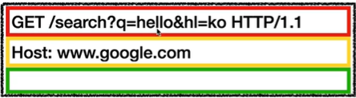
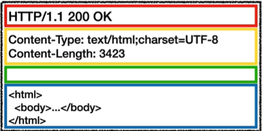
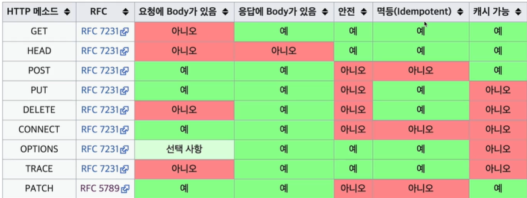

# IP(인터넷 프로토콜)

컴퓨터들이 통신하기 위해선 중간에 ‘**인터넷**’이란 것이 존재한다.

이 인터넷이란 것이 단순한 구조로 되어 있지 않고, 클라이언트와 서버를 연결 시켜주는 수많은 **중간 노드**들을 거쳐서 데이터를 주고 받는다.

이 데이터를 안전하게 주고 받으려면 ‘**특정한 규칙**’이 필요하다. 출발지에서 송신자/수신자를 특정하는 주소(IP)를 가지고 목적지까지 효율적으로 도달하는 경로를 찾기 위해 중간 노드들에 물어보면서 전달된다.

&nbsp;

### IP 프로토콜의 한계

- 비연결성: 패킷을 받을 대상이 없거나 서비스 불능 상태여도 클라이언트는 그 사실을 모른 채 패킷 전송을 하고 응답이 오기까지 기다려야 한다.
- 비신뢰성: 둘 이상의 패킷을 보낼 때, 그 중에 한 패킷이 유실될 수 있고, 패킷들이 순서대로 오지 못해 원치 않는 결과를 받을 수 있다.
- 프로그램 구분: 같은 IP를 사용하는 서버에서 통신하는 애플리케이션이 둘 이상이면 어떻게 구분할 것인가?

&nbsp;

### DNS(Domain Name System)

마치 전화번호부와 같이 기억하기 힘든 IP 주소를 인간이 기억하기 쉬운 문자열로 매핑하여 저장하거나 불러올 수 있다.

클라이언트가 브라우저에서 도메인 명을 입력할 때 가장 먼저 DNS에서 매핑된 IP 주소를 읽어와서 서버로 접속한다.

&nbsp;

# TCP와 UDP

### 인터넷 프로토콜 4계층

1. 애플리케이션 계층 (HTTP, FTP) - 웹 브라우저, 게임, 채팅 프로그램 등
2. 전송 계층 (TCP, UDP) - TCP/UDP 프레임
3. 인터넷 계층 (IP) - IP 패킷
4. 네트워크 인터페이스 계층 - Ethernet 프레임

- **패킷이란?** 컴퓨터 네트워크가 전달하는 데이터의 형식화된 블럭
    - 출발지IP, 목적지 IP 등
    - 출발지 포트, 목적지 포트, 전송 제어, 순서, 검증 정보 등
    - 전송 데이터

- **포트란?** 프로세스 구분할 수 있는 번호이다.
    - 예) IP는 아파트 몇 동에 사는지, 포트는 몇 호에 사는지
    - 기본적으로 포트는 0~65535 할당 가능하다.
        - 현재 전세계에서 지정한 Well-known 포트(0~1023)를 제외하고, 포트 번호를 부여하는 것이다.

&nbsp;

### TCP(Transmission Control Protocol)

- TCP는 전송 제어 프로토콜이다.
- 연결지향적 - **3 way handshake** (SYN, SYN+ACK, ACK)
    - 이 과정에서 서버와의 연결이 되지 않으면 데이터를 전송하지 않도록 함.
    - 논리적인 연결
- 데이터 전달 보증
- 패킷 순서 보장: 잘못 보내면 다시 보내게 함.

&nbsp;

### **UDP(User Datagram Protocol)**

- 단순하고 빠르다.
- 하지만 3 way handshake 없음, 데이터 전달 보증 없음, 순서 보장 하지 않음.
- UDP는 기능은 하나도 없지만 애플리케이션에서 추가 작업을 할 수 있다. (최적화 부분에서 요즘 각광 받는다고 함.=HTTP/3)

&nbsp;

# URI와 웹 브라우저 요청 흐름

### URI(Uniform Resource Identifier)

URI는 리소스를 식별하는 통일된 방식이다. 리소스는 URI로 식별할 수 있는 **모든 것**이다. 이것들을 서 구분하기 위한 식별자가 필요하다.

“URI는 로케이터(locator), 이름(name) 또는 둘 다 추가로 분류될 수 있다.”

- URL(Uniform Resource **Locator**):
    - https://naver.com?name=hi#nose
        
        → protocol://host:port/path?querystring#fragment
        
        → fragment는 내부 북마크 등에 사용한다. 서버로 전송되는 정보는 아니다.
        
- URN(Uniform Resource **Name**): urn:comany:name:nose

→ URN은 잘 안 쓰기 때문에 URI를 URL로 통용되어 사용하기도 한다.

&nbsp;

### 웹 브라우저 요청 흐름

인터넷 계층에서 패킷을 생성할 때, 전송 데이터로 HTTP 메시지를 포함하여 보내게 된다. HTTP 메시지에는 URL 정보가 담겨있으면 어떤 요청(GET, POST 등)을 보내는 지에 대한 정보도 같이 보내게 된다. 이 패킷이 수 많은 중간 노드들을 통해서 목적지 노드로 도달하게 되고, 서버는 HTTP 메시지를 분석하여 클라이언트의 요청을 확인한다. 그런 다음에 서버에서 클라이언트에게 응답 메시지를 전송하는데 클라이언트가 요청한 것은 페이지이기 때문에 서버가 전달하는 HTTP 메시지는 HTML 일 것이다. 서버에서 클라이언트로 응답하는 과정 역시 이전과 동일하다.

&nbsp;

# HTTP 기본

&nbsp;

### HTTP(HyperText Transfer Protocol)

- HTTP는 거의 모든 형태의 데이터를 전송할 수 있는 프로토콜이다.
    - HTML, TEXT, IMAGE, JSON, XML 등
- 현재 많이 사용하고 있는 버전은 **HTTP/1.1** 이다.
- HTTP/3는 TCP 대신에 UDP를 사용하는 방법으로, 좀 더 성능 개선한 버전이다.
    - 아직까지는 TCP 기반 HTTP/2 까지는 많이 사용하고 있다. HTTP/3는 점점 확대되어 가는 분위기

&nbsp;

### 클라이언트-서버 구조

- Request-Response 구조
- 클라이언트는 필요한 정보를 얻기 위해 서버에 요청을 보내고 서버로부터의 응답을 기다린다.
- 서버는 클라이언트로부터 요청을 받고 필요한 정보를 클라이언트에게 보낸다.

&nbsp;

### 무상태 프로토콜

- 서버는 클라이언트의 상태를 보존하지 않는다.
- 서버 입장에서 클라이언트의 요청들은 서로 독립적으로 존재하기 때문에 만약 클라이언트가 서버로의 요청을 보낼 때 필요한 정보들을 한꺼번에 보낼 수 있도록 해야한다.
- 무상태는 응답 서버를 무한 증설이 가능하다.
- 로그인과 같이 상태를 유지해야 하는 경우, 브라우저 쿠키와 세션을 사용해서 상태를 유지하는 방법도 있다.
    - 그럼에도 상태유지는 최소한으로 사용하는 것이 좋다.
- 같은 시점에 대용량 트래픽이 발생할 경우 대응하기 어렵다.

&nbsp;

### HTTP 메시지 구조

- **요청 메시지**
    - start-line
        - HTTP 메서드: GET, POST, PUT, DELETE … (서버가 수행해야 할 동작)
        - 요청 대상: 절대경로[?쿼리]
        - HTTP 버전

    

&nbsp;

- **응답 메시지**    
    - start-line
        - HTTP 버전
        - HTTP 상태 코드: 200/400/500 …
        - 이유 문구
    - header (HTTP 전송에 필요한 모든 부가 정보)
        - Content-Type
        - Content-Length
    - body (실제 전송할 데이터)
        - HTML, IMAGE, JSON, byte 등

    

&nbsp;

# HTTP 메서드

리소스는 생성하고 수정하고 조회하는 역할을 아니다. 그 행위를 하는 주체가 리소스인 것이다.

URI로 행위를 구분하지 말라는 것! URI는 리소스만 식별!

그 행위들을 식별할 수 있는 방법은 **HTTP 메서드**를 이용한다!

&nbsp;

### HTTP 메서드 종류

- GET: 리소스 조회
- POST: 요청 데이터 처리, 주로 등록에 사용
- PUT: 리소스를 대체, 해당 리소스가 없으면 생성
    - 클라이언트가 덮어쓰기 할 리소스의 존재를 알고있다. (POST는 모름)
    - 수정하는 것이 아니다.
- PATCH: 리소스 부분 변경(수정)
- DELETE: 리소스 삭제
- HEAD: GET과 동일하지만 메시지 부분을 제외하고, 상태 줄과 헤더만 반환
- OPTIONS: 대상 리소스에 대한 통신 가능 옵션을 설명 (주로 CORS에 사용)
- CONNECT: 대상 자원으로 식별되는 서버에 대한 터널을 설정
- TRACE: 대상 리소스에 대한 경로를 따라 메시지 루프백 테스트를 수행

&nbsp;

### 예제

- 회원 목록 조회: **GET** /members
- 회원 조회: **GET** /members/{id}
- 회원 등록: **POST** /members/{id}
- 회원 수정: **PATCH** /members/{id}
- 회원 삭제: **DELETE** /members/{id}

&nbsp;

### HTTP 메서드의 속성

- **안전**: 호출했을 때 리소스에 변경이 일어나는 것은 기본적으로 안전하지 않는다.
- **멱등**: N번 호출해도 결과가 똑같다.
    - PUT은 덮어쓰기이기 때문에 하나로 존재하지만, POST는 리소스가 중복될 수 있다.
    - 자동 복구 메커니즘에 사용할 수 있다.
    - 멱등은 외부 요인으로 중간에 리소스가 변경되는 것 까지는 고려하지 않는다.
- **캐시**: 응답 결과 리소스를 캐시해서 사용할 수 있는가?
    - GET, HEAD 정도에만 캐시로 사용하며, POST와 PATCH도 사용할 순 있지만 구현이 쉽진 않다.

&nbsp;

    

