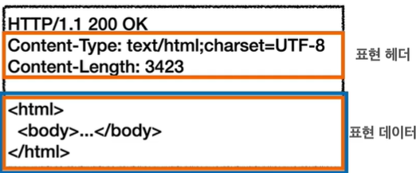
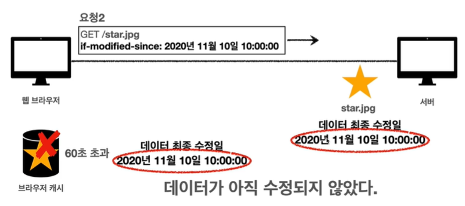
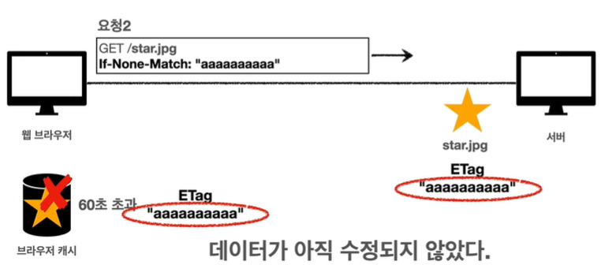
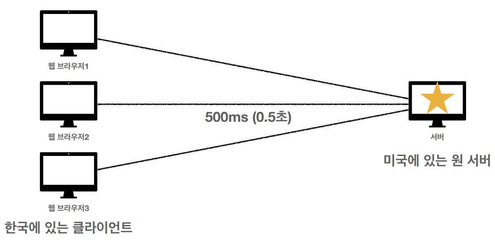

# HTTP 헤더 - 일반헤더

    

&nbsp;

### HTTP 헤더

- **HTTP 헤더**는 HTTP 전송에 필요한 모든 부가 정보를 담는 필드이다.
    - 메시지 바디 내용, 메시지 바디 크기, 압축, 인증, 요청 클라이언트, 서버 정보, 캐시 관리 정보 등
    - 필요시 key-value 형식으로 임의의 헤더 추가 가능
- **표현 헤더**는 **표현 데이터**를 해석할 수 있는 정보를 제공한다.
    - 데이터 유형(HTML, JSON 등), 데이터 길이, 압축 정보 등등
- 메시지 본문(표현 데이터=message body=payload)을 통해 **표현 데이터** 전달
    - **표현 데이터**는 요청이나 응답에서 전달할 실제 데이터이다.

&nbsp;

### 표현

- Content-Type: 표현 데이터의 형식 (text/html; charset=utf-8, application/json, image/png …)
- Content-Encoding: 표현 데이터의 압축 방식 (gzip, deflate, identity …)
- Content-Language: 표현 데이터의 자연 언어 (ko, en, en-US …)
- Content-Length: 표현 데이터의 길이 (바이트 단위, Transfer-Encoding을 사용하면 이 부분을 작성해선 안 됨.)

&nbsp;

### 콘텐츠 협상과 우선순위

클라이언트가 선호하는 표현 요청

Quality Values(q) 값을 사용하여 우선순위 부여 (0~1, 클수록 높은 우선순위)

구체적인 것이 우선된다.

- Accept: 클라이언트가 선호하는 미디어 타입 전달
    - */* < text/* < text/plain < text/plain;format=flowed
    - text/*;q=0.3, text/html;q=0.7, text/html;level=1, text/html;level=2;q=0.4, */*;q=0.5
- Accept-Charset: 클라이언트가 선호하는 문자 인코딩
- Accept-Encoding: 클라이언트가 선호하는 압축 인코딩
- Accept-Language: 클라이언트가 선호하는 자연 언어
    - koKR;q=1,ko;q=0.9,en-US;q=0.8,en;q=0.7

&nbsp;

### 전송 방식

- 단순 전송
    - Content-Length 값을 알고 있을 때, 한 번에 콘텐츠를 해당 길이만큼 받아내는 것.
- 압축 전송
    - Content-Encoding이 지정되었을 때, Content-Length가 줄어든다.
- 분할 전송
    - 용량이 너무 큰 데이터를 전송할 때, Transfer-Encoding: chunked로 지정하여 분할하여 데이터를 쪼개서 보낼 수 있다.
    - 분할 전송을 사용할 때는 Content-Length를 지정하면 안 된다.
- 범위 전송
    - 보낼 전체 데이터를 범위로 나누고 전송시 전체 데이터를 한번에 보내지 않고 해당 범위에 속하는 데이터만 전송한다.

&nbsp;

### 일반 정보

- From
    - 유저 에이전트의 이메일 정보
    - 일반적으로 잘 사용되지 않음
    - 검색 엔진 같은 곳에서 주로 사용
    - 요청에서 사용
- Referer
    - 현재 요청된 페이지의 **이전 웹 페이지 주소**
    - A→B로 이동하는 경우 B를 요청할 때 Referer: A를 포함해서 요청
    - Referer를 사용해서 유입 경로 분석 가능
    - 요청에서 사용
- User-Agent
    - 예) user-agent: Mozilla/5.0 (Macintosh; Intel Mac OS X 10_15_7) AppleWebKit/537.36 (KHTML, like Gecko) Chrome/86.0.4240.183 Safari/547.36
    - 클라이언트의 애플리케이션 정보 (웹 브라우저 정보 등)
    - 통계 정보
    - 어떤 종류의 브라우저에서 장애가 발생하는지 파악 가능
    - 요청에서 사용
- Server
    - 요청을 처리하는 origin 서버의 소프트웨어 정
    - 예) Server: Apache/2.2.22 (Debian)
    - 응답에서 사용
- Date
    - 메시지가 발생한 날짜와 시간
    - 예) Date: Tue, 15 Nov 1994 08:12:31 GMT
    - 응답에서 사용

&nbsp;

### 특별한 정보

- Host: 요청한 호스트 정보(도메인), 필수 값
- Location: 페이지 리다이렉션
- Allow: 허용 가능한 HTTP 메서드
- Retry-After: 유저 에이전트가 다음 요청을 하기까지 기다려야 하는 시간

&nbsp;

### 인증

- 클라이언트 인증 정보를 서버에 전달
- 예) Authorization: Basic xxxxxxxxxxx
- 예) WWW-Authenticate: Newauth realm=”app”, type=1, title=”Login to \”apps\””, Basic realm=”simple”

&nbsp;

### 쿠키

쿠키는 서버가 어떤 데이터를 브라우저 측에 저장한 후 다시 그 데이터를 받아오는 기술, 또는 그 데이터 자체를 뜻한다.

브라우저가 원격에 있는 서버와 네트워크를 통해 쿠키를 주고 받으려면 이 둘 간에는 일정한 약속이 필요하다.

이 약속은 바로 HTTP 프로토콜 상에서 구현되며 쿠키는 HTTP 메시지의 헤더(header) 영역을 통해서 정의한다.

키는 `<이름>=<값>` 형태를 지니는 단순한 문자열이다. 서버와 브라우저는 기본적으로 HTTP 메시지 안에 이 쿠키를 담아서 주고 받게 됩니다.

- 예) set-cookie: **sessionId=abcde1234; expires**=Sat, 26-Dec-2020 00:00:00 GMT; **path**=/; **domain**=.google.com; **Secure**
- **Set-Cookie**: 서버에서 클라이언트로 쿠키 전달(응답)
- **Secure:** https인 경우에만 전송된다.
- **HttpOnly**: XSS 공격 방지, 자바스크립트에서 접근 불가, HTTP 전송에만 사용
- **SameSite**: XSRF 공격 방지, 요청 도메인과 쿠키에 설정된 도메인이 같은 경우만 쿠키 전송

쿠키는 ‘**사용자 로그인 세션 관리**’, **‘광고 정보 트래킹’** 등에 사용된다.

쿠키 정보는 항상 서버에 전송되기 때문에 네트워크 트래픽을 유발할 수 있어 최소한의 정보만 사용할 수 있도록 해야한다.

만약, 서버에 전송하지 않고 웹 브라우저 내부에 데이터를 저장하고 싶다면 localStroage, SessionStorage를 사용할 수 있다.

쿠키는 지정된 **expires**가 만료되면 쿠키가 삭제된다. 쿠키를 생성할 때 **max-age** 값으로 임의로 만료일을 지정할 수 있다.

&nbsp;

# HTTP 헤더 - 캐시와 조건부 요청

### 캐시

캐시는 클라이언트가 요청하는 html, js, css 등에 대해 첫 요청 시에 파일을 내려받아 특정 위치에 복사본을 저장하고, 

이후 동일한 URL의 리소스 요청은 다시 내려 받지 않고 내부에 저장한 파일을 사용하여 더 빠르게 서비스하기 위한 것이다.

캐시를 사용하면 캐시 가능 시간동안 네트워크를 사용하지 않아도 되며, 비싼 네트워크 사용량을 줄일 수 있다.

그리고 브라우저 로딩 속도가 매우 빨라 사용자 경험을 향상시킬 수 있다.

캐시 유효 시간이 초과되면, 서버를 통해 데이터를 다시 조회하고, 캐시를 갱신한다. 이때 다시 네트워크 다운로드가 발생한다.

&nbsp;

### 검증 헤더와 조건부 요청

- 데이터 변경이 없을 때
    - 캐시: 2020년 11월 10일 10:00:00 vs 서버: 2020년 11월 10일 10:00:00
    - 304 Not Modified, 헤더 데이터만 전송(Body 미포함)
    - 전송 용량: 0.1M
    - 즉, 클라이언트 요청에 대한 응답으로 HTTP 바디가 없는 **304 Not Modified**를 반환하여 클라이언트는 캐시에 저장되어 있는 데이터를 재활용한다.
    

    

    
- 데이터 변경이 있을 때
    - 캐시: 2020년 11월 10일 10:00:00 vs 서버: 2020년 11월 11일 11:00:00
    - 200 OK, 모든 데이터 전송
    - 전송 용량 1.1M
- ETag(Entity Tag)
    - 캐시용 데이터에 임의의 고유한 버전 이름을 달아둠
    - 데이터가 변경되면 이 이름을 바꾸어서 변경함
    - 캐시 제어 로직을 서버에서 완전히 관리한다. (클라이언트가 캐시 메커니즘을 모르기 때문에 비교적 안전)
    

    

    

&nbsp;

### 캐시와 조건부 요청 헤더

- Cache-Control
    - max-age: 캐시 유효 시간, 초 단위
    - no-cache: 데이터는 캐시해도 되지만, 항상 origin 서버에 검증하고 사용한다.
    - no-store: 데이터에 민감한 정보가 있으므로 저장하면 안 된다.
- Expires
    - 캐시 만료일을 정확한 날짜로 지정
    - 지금은 Cache-Control: max-age 권장하기 때문에 같이 사용하게 되면 Expires는 무시된다.
- 검증 헤더
    - ETag
    - Last-Modified
- 조건부 요청 헤더
    - If-Match, If-None-Match: ETag 값 사용
    - If-Modifed-Since, If-Unmodified-Since: Last-Modified 값 사용

&nbsp;

### 프록시 캐시

    

- Cache-Control: public
    - 응답이 public 캐시에 저장되어도 된다.
- Cache-Control: private
    - 응답이 해당 사용자만을 위한 것, private 캐시에 저장해야 한다.
- Cache-Control: s-maxage
    - 프록시 캐시에만 적용되는 max-age
- Age: 60 (HTTP 헤더)
    - origin 서버에서 응답 후 프록시 캐시 내에 머문 시간 (초)

&nbsp;

### 캐시 무효화

실수로라도 캐시가 일어나서는 안되는 리소스일 경우에 사용된다.

- Cache-Contorl: no-cache
    - 데이터는 캐시해도 되지만, 항상 origin 서버에 검증하고 사용한다.
    - 오류를 반환하기보다는 **오래된 데이터라도 보여주기**를 원할 때
- Cache-Control: no-store
    - 데이터에 민감한 정보가 있으므로 **저장하면 안 된다.**
- Cache-Control: must-revalidate
    - 캐시 만료 후 최초 조회시 origin 서버에 검증해야 한다.
    - origin 서버 접근 실패시 **반드시 오류가 발생**해야 한다. - 504 (Gateway Timeout)
    - must-revalidate는 캐시 유효 시간이라면 캐시를 사용한다.
- Pragma: no-cache