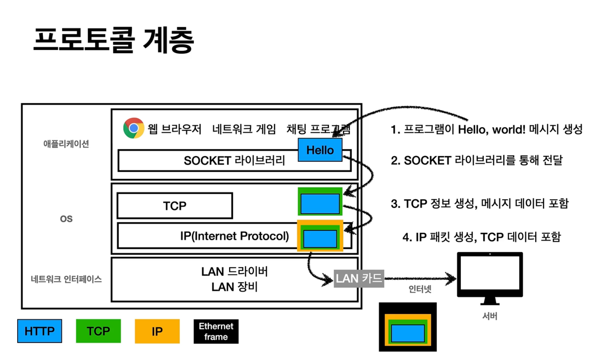
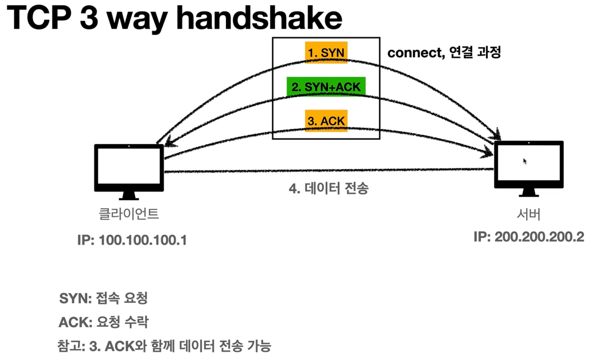

## IP(인터넷 프로토콜)
- 다른 서버와 통신을 하고 싶을 때 최소한의 규칙
- IP 프로토콜의 역할
    - 지정한 ip 주소에 데이터 전달
    - 패킷(Packet)이라는 통신 단위로 데이터 전달
- IP 프로토콜의 한계
    - 비연결성 : 패킷을 받을 대상이 없거나 서비스 불능 상태여도 패킷 전송
    - 비신뢰성 : 중간에 패킷이 사라지거나 패킷을 여러개 보냈을 때 순서대로 도착하지 않을 수 있음
    - 프로그램 구분 : 같은 IP를 사용하는 애플리케이션이 둘 이상일 때 각각의 애플리케이션을 구분을 하기 어려움

## TCP, UDP
IP프로토콜이 가진 문제점(패킷 소실, 순서 꼬임 등)을 TCP 프로토콜이 해결해줌
- [참고] 인터넷 프로토콜 스택의 4계증
    - 애플리케이션 계층 - HTTP, FTP
    - 전송 계층 - TCP, UDP
    - 인터넷 계층 - IP
    - 네트워크 인터페이스 계층

    HTTP 의 정보를 포함해 TCP 패킷으로 생성하고, 그걸 또 포함하여 IP 패킷으로 만들고 마지막으로 이더넷 프레임을 씌워 랜카드를 통해 나감

- TCP(Transmission Control Protocol 전송 제어 프로토콜) 특징
    - 연결지향 = 상대랑 내가 연결이 됐는지를 먼저 확인하고 통신을 함
        - TCP 3 way handshake (가상 연결) : 물리적으로 연결된 것이 아닌 개념적으로만 연결된 것을 의미함
        
    - 데이터 전달 보증 = 중간에 패킷이 누락됐으면 알 수 있음
    - 순서 보장 = 서버에 데이터를 보낼 때 중간에 순서를 건너뛰면 서버로부터 그 순서부터 다시 보내라는 요청이 옴
    - 신뢰할 수 있는 프로토콜
    - 현재는 대부분 TCP 사용

- UDP(User Datagram Protocol 사용자 데이터그램 프로토콜) 특징
    - 기능이 거의 없음 : 연결지향 기능 없음, 데이터 전달 보증 기능 없음, 순서 보장 기능 없음
    - 하지만 단순하고 빠름
    - IP와 거의 같지만 PORT 와 체크섬이 추가됨
        - 체크섬? 중복검사의 형태로 송신된 자료의 무결성을 보호하는 단순한 방법
    - 최근에는 HTTP3에서는 3 way handshake도 줄여서 UDP도 꽤 사용하는 추세

## PORT
- IP는 목적지 서버를 찾는 것이고, 포트는 그 서버 안에서 돌아가는 애플리케이션을 구분하는 것
- 즉, 같은 IP 내에서 프로세스를 구분하는 것
- 0 ~ 65535 할당 가능
- 0 ~ 1023 은 잘 알려진 포트로 사용하지 않는 것이 좋다.

## DNS
- 도메인 네임 시스템 (Domain Name System)
- IP는 기억하기도 어렵고, 변경될 수도 있다.
- 도메인 명을 IP 주소로 변환