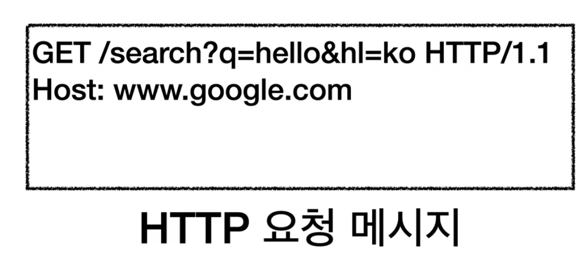
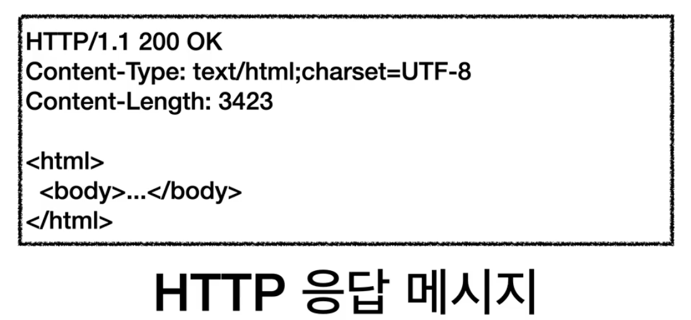

## URI
- Uniform Resource Identifier
- URI? : 리소스를 식별하는 가장 큰 개념으로 URL과 URN을 포함하는 개념이다.
    - Uniform : 리소스를 식별하는 통일된 방식
    - Resource : 자원. URI로 식별할 수 있는 모든 것(제한 없음)
    - Identifier : 다른 항목과 구분하는데 필요한 정보
- URL? : Resource Locator. 리소스의 위치로 이해하면 됨
    - Locator : 리소스가 있는 위치를 지정
- URN? : Resource Name. 리소스의 이름
    - Name : 리소스에 이름을 부여


## 웹 브라우저 요청 흐름
```https://www.google.com/search?q=hello&hl=ko``` 
- 위의 url을 조회하였을 때 처리 과정
    1. 웹 브라우저가 DNS 조회하여 IP 알아냄. https 의 포트는 443. 
    2. 웹 브라우저가 HTTP 요청 메시지 생성
    
    3. 소켓 라이브러리를 통해 HTTP 메시지 전달
    4. HTTP 메시지를 포함한 TCP/IP 패킷 생성
    5. 랜을 통해 패킷 정보가 인터넷으로 전달됨
    6. 수많은 인터넷 노드를 통해 패킷이 구글 서버로 전달됨
    7. 구글 서버는 전달 받은 요청 패킷의 HTTP 메시지를 둘러싼 TCP/IP 패킷 정보는 버림
        HTTP 메시지를 해석함
    8.  search? 뭔가 검색을 하겠다는 거구나. 쿼리는 hello, hl 은 한국어네? hello와 관련된 결과를 한국어로 받겠다는 거구나. 해서 검색엔진을 통해 데이터를 찾음
    9. 구글 서버에서 HTTP 응답 메시지 생성
    
    10. 구글 서버가 HTTP 메시지를 포함한 TCP/IP 패킷 생성 및 전달