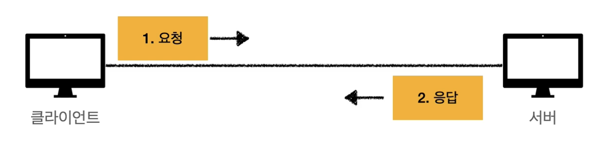
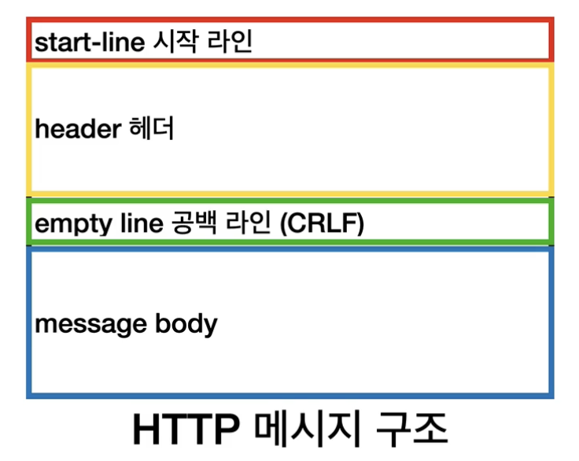
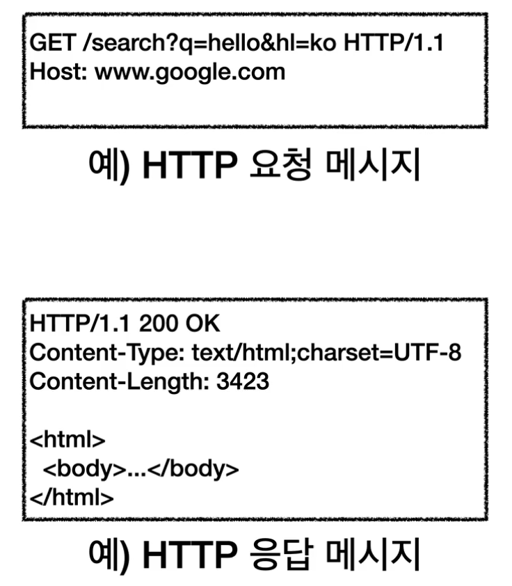

## HTTP
- HyperText Transfer Protocol
- 거의 모든 형태의 데이터 전송 가능
    - HTML, TEXT
    - 이미지, 음성, 영상 파일
    - JSON, XML (API)
- 서버 간에 데이터를 주고 받을 때도 대부분 HTTP 사용
- HTTP/1.1, HTTP/2 는 TCP 기반
- HTTP/3 은 UDP 기반
- 현재 HTTP/1.1 을 주로 사용하지만 다른 버전들도 사용수가 증가하는 추세
- 특징
    1. 클라이언트 서버 구조
        
        - Request Response 구조
        - 클라이언트는 서버에 요청을 보내고, 응답을 대기
        - 서버가 요청에 대한 결과를 만들어서 클라이언트에 응답
        - 클라이언트와 서버를 분리하는 것은 중요함! => 비즈니스 로직이나 데이터는 서버에 넣고, 클라이언트는 UI나 UI 사용성에 집중함. 이렇게 하면 클라이언트오 서버가 각각 독립적으로 진화할 수 있음
    2. 무상태 프로토콜(Stateless) 지향
        - Stateful 은 클라이언트의 이전 상태를 유지하는 것
        - 서버가 클라이언트의 상태를 보존하지 않는 것
        - 무상태는 응답 서버를 쉽게 바꿀 수 있기 때문에 무한한 서버 증설이 가능
        - 클라이언트가 요청할 때부터 필요한 데이터를 다 담아서 보냄 -> 아무 서버나 호출해도 상관 없음. 중간에 서버1이 장애가 나면 다른 서버에 보내도 상관 없음
        - 수평 확장(scale out)에 유리
        - 모든 것은 무상태(예. 단순 서비스 소개 화면)로 설계할 수도 있고, 없을 수도(예. 로그인) 있다.
        - 상태를 유지하기 위해서는 일반적으로 브라우저 쿠키와 서버 세션 등을 사용해서 상태를 유지한다. => 최소한만 사용하는 것이 좋음
        - 데이터를 너무 가지고 있는 단점이 있음
    3. 비연결성(Connectionless)
        - 클라이언트가 요청을 하고, 응답을 받으면 연결을 끊음 => 서버가 유지하는 자원을 최소한으로 사용.
        - 일반적으로 초 단위 이하의 빠른 속도로 응답
        - 1시간 동안 수천 명이 서비스를 사용해도 실제 서버에서 동시에 처리하는 요청은 수십개 이하로 매우 적음
        - 서버 자원을 효율적으로 사용할 수 있음
        - 단점
            - 클라이언트가 요청할 때마다 TCP/IP 연결을 새로 맺어야 하므로 소요시간 증가
            - 웹 페이지에서 요청할 때마다 HTML 만이 아닌 자바스크립트, css, 이미지 등의 자원이 함께 다운로드 됨
            - 지금 HTTP는 지속 연결(Persistent Connections)로 문제 해결
    4. 단순하고 확장 가능

# HTTP 메시지
- HTTP 메시지 구조

- 시작라인(start-line)
    - 요청 메시지
        - start-line 을 request-line 이라고 함
        - reques-line = method SP(공백) request-target SP HTTP-version CRLF(엔터)
        - HTTP 메서드 : 서버가 수행해야할 동작 지정. GET, POST, PUT, DELETE 등
        - 요청 대상 : 절대경로[?쿼리]. * 절대경로 = "/" 로 시작하는 경로를 말함.
    - 응답 메시지
        - start-line 을 status-line 이라고 함
        - status-line = HTTP-version SP status-code SP reason-phrase CRLF
        - HTTP 상태 코드 : 요청 성공, 실패를 나타냄. 200(성공), 400(클라이언트 요청 오류), 500(서버 내부 오류)
        - 이유 문구 : 사람이 이해할 수 있는 짧은 상태 코드 설명 글
- HTTP 헤더
    - header-field = field-name ":" OWS(띄어쓰기 허용) field-value OWS
    - field-name은 대소문자 구문 없음
    - HTTP 전송에 필요한 모든 부가정보(메시지 바디를 제외한 모든 메타 데이터가 있다고 보면 됨)
- HTTP 메시지 바디
    - 실제 전송할 데이터
    - HTML 문서, 이미지, 영상, JSON 등 byte 로 표한혈 수 있는 모든 데이터 전송 가능