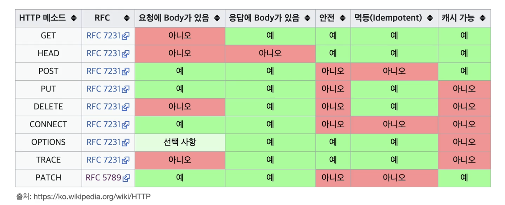

## HTTP 메서드
- API URI 를 만들 때
    - [예시]
        ```
        - 회원 목록 조회 /read-member-list
        - 회원 조회 /read-member-by-id
        - 회원 등록 /create-member
        - 회원 수정 /update-member
        - 회원 삭제 /delete-member
        ```
    - URI를 설계할 때 중요한 것은 리소스를 식별하는 것
        - 리소스란 회원을 등록하고 조회하는 행위가 아닌 회원 자체가 리소스이다.
        - 리소스를 식별할 때는 리소스만 식별하면 된다. => 회원 리소스를 URI에 매핑하
    - 따라서 위의 예시는 좋지 않은 URI 이다.
    - 리소스를 식별하고 URI 계층 구조를 활용한 예시는 다음과 같다.
    - [예시]
        ```
        - 회원 목록 조회 /members
        - 회원 조회 /members/id
        - 회원 등록 /members/{id}
        - 회원 수정 /members/{id}
        - 회원 삭제 /members/{id}
        ```
        - 계층 구조상 상위를 컬렉션으로 보고 복수단어 사용 권장(member X, members O)
- 종류
    - GET : 리소스 조회
    - POST : 요청 데이터 처리, 주로 등록에 사용
    - PUT : 리소스를 대체, 해당 리소스가 없으면 생성
    - PATCH : 리소스 부분 변경
    - DELETE : 리소스 삭제
    - HEAD : GET과 동일하지만 메시지 부분을 제외하고, 상태 줄과 헤더만 반환
    - OPTIONS : 대상 리소스에 대한 통신 가능 옵션(메서드)을 설명(주로 CORS에서 사용)
    - CONNECT : 대상 자원으로 식별되는 서버에 대한 터널을 설정
    - TRACE : 대상 리소스에 대한 경로를 따라 메시지 루프백 테스트를 수행

## GET 
- 리소스 조회
- 서버에 전달하고 싶은 데이터는 query(쿼리 파라미터, 쿼리 스트링)를 통해서 전달
- 메시지 바디를 사용해서 데이터를 전달할 수 있지만, 지원하지 않는 곳이 많아서 권장하지 않음

## POST
- 요청 데이터 처리
- 메시지 바디를 통해 서버로 요청 데이터  전달
- 서버는 요청 데이터를 처리
- 메시지 바디를 통해 들어온 데이터를 처리하는 모든 기능을 수행
- 주로 전달된 데이터로 신규 리소스 등록, 프로세스 처리에 사용

## PUT
- 리소스를 대체
    - 리소스가 있으면 대체, 없으면 생성
    - 리소스를 덮어쓴다는 얘기!
    - POST와 달리 클라이언트가 리소스 위치를 알고(=리소스를 식별) URI 지정
- 리소스를 수정한다는 개념보다는 대체한다는 게 맞음!

## PATCH
- PUT은 리소스를 완전히 대체하는데, 부분 대체하기 위해서 사용하는 메서드

## DELETE
- 리소스 제거

# HTTP 메서드의 속성

- 안전(Safe Methods)
    - 호출해도 리소스를 변경하지 않는다.  
- 멱등(Idempotent)
    - f(f(x)) = f(x)
    - 한 번 호출하든 두 번 호출하든 몇 번을 호출하든 결과가 동일
    - GET : 멱등. 한 번 조회하든 두 번 조회하든 같은 결과 조회
    - PUT : 멱당. 결과를 대체하기 때문에 같은 요청을 여러번 해도 최종 결과가 같음
    - DELETE : 멱등. 결과를 삭제하기 때문에 같은 요청을 여러번 해도 삭제된 결과가 같음
    - POST : 멱등 아님. 두 번 호출하면 같은 결제가 중복해서 발생할 수 있음
    - 자동 복구 매커니즘으로 활용할 수 있음!
    - GET으로 재조회 중간에 다른 곳에서 리소스가 바뀐다면?
        - [예시] GET 으로 나이 조회 age = 20, PUT 으로 나이 변경 age = 30, GET 으로 나이 다시 조회 age = 30
        - 멱등은 외부 요인으로 중간에 리소스가 변경되는 것까지 고려하지 않음 => 멱등하지 않다고 판단하는게 맞음. 이렇게 바뀌는 것은 서버에서 체크해줘야 함
- 캐시 가능 
    - 응답 결과 리소스를 캐시해서 사용
    - GET, HEAD, POST, PATCH 가 캐시 가능하나 실제로는 GET, HEAD 정도만 캐시로 사용함