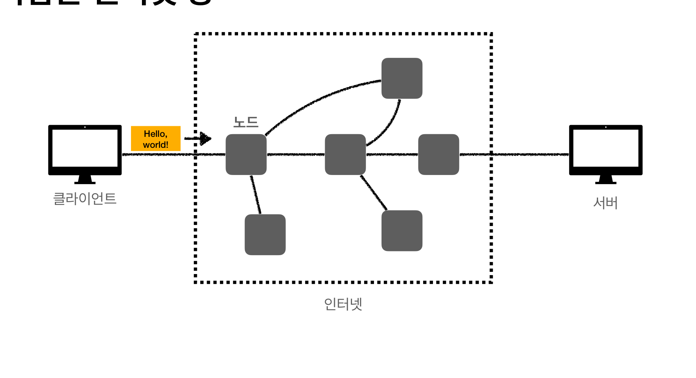
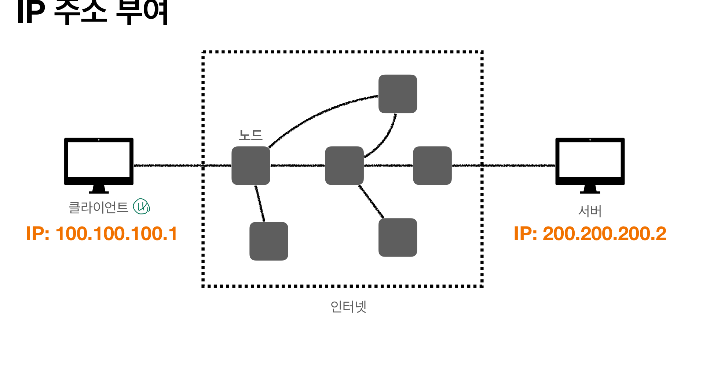
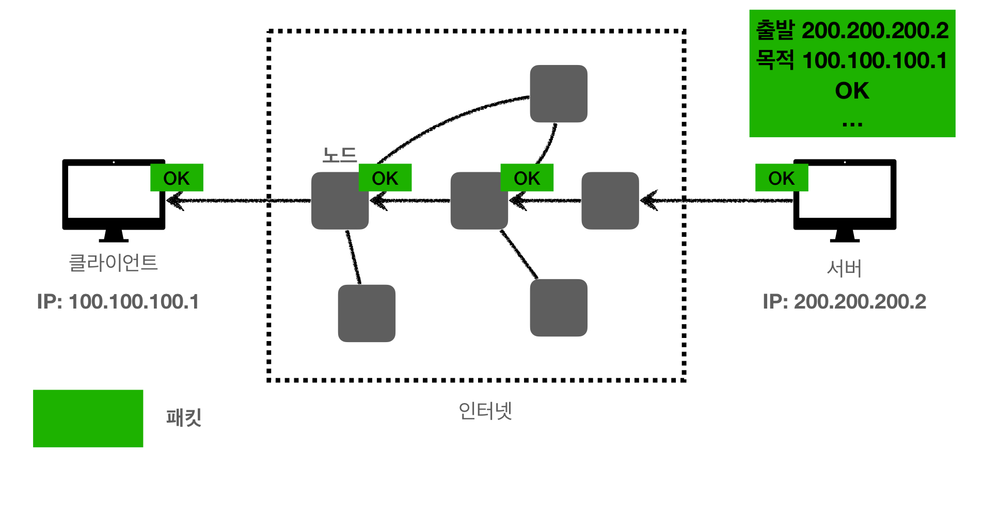
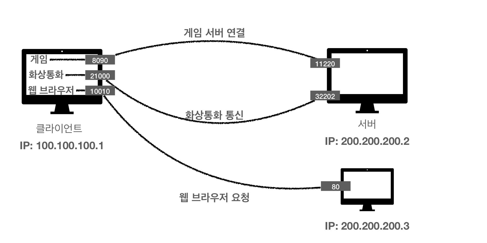
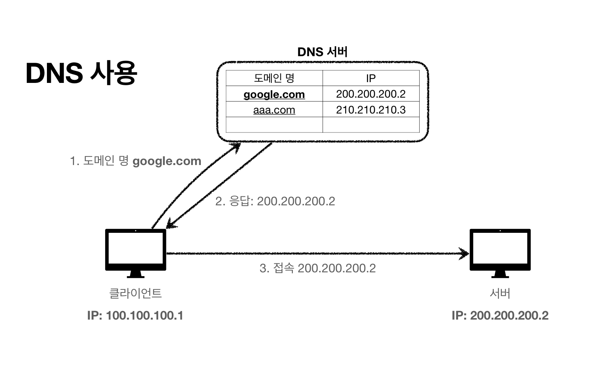

# 인터넷 네트워크

## 인터넷 통신

### 복잡한 인터넷 망

- 클라이언트가 `Hello, world` 메시지를 전달하려는데, 전달 받아야 하는 PC가 물리적으로 멀리 떨어져 있다.
- 인터넷 망을 통해서 메시지를 보내야 하는데, 인터넷이 단순하지 않다.
- 수많은 중간 노드를 안전하게 넘어가야 한다.
- 복잡한 상황에서 어떤 규칙으로 목적지까지 갈까?

### IP(Internet Protocol, 인터넷 프로토콜)

#### IP 역할

- 지정한 IP주소에 데이터를 전달가능하도록 한다.
- 패킷(Packet)이라는 통신 단위로 데이터를 전달한다.

### IP 패킷 정보

- IP 프로토콜에서 데이터가 전달되는 기본 단위를 말한다.
- 출발지 IP, 목적지 IP 등

### 클라이언트 패킷 전달

### 서버 패킷 전달

### IP 프로토콜의 한계

- 비연결성
  - 패킷을 받을 대상이 없거나 서비스 불능 상태여도 패킷 전송
- 비신뢰성
  - 중간에 패킷이 사라지거나, 순서대로 오지 않는 경우
- 프로그램 구분
  - 같은 IP를 사용하는 서버에서 통신하는 애플리케이션이 둘 이상인 경우

## TCP / UDP

### 프로토콜 계층
[애플리케이션 계층]
1. 프로그램이 Hello, world! 메시지 생성
2. SOCKET 라이브러리를 통해 전달
[OS 계층]
3. TCP 정보 생성 (메시지 데이터 포함)
4. IP 패킷 생성(TCP 데이터 포함)

### TCP/IP 패킷 정보
- 출발지 PORT
- 목적지 PORT
- 전송 제어 정보
- 순서 정보
- 검증 정보

### TCP(Transmission Control Protocol) 특정
- 연결 지향 
  - TCP 3 way handshake
  - 1. 클라이언트: SYN 
  - 2. 서버: SYN + ACK
  - 3. 클라이언트: ACK (함께 데이터 전송 가능)
  - 4. 클라이언트: 데이터 전송
- 데이터 전달 보증
  - 1. 클라이언트: 데이터 전송
  - 2. 서버: 응답으로 데이터 전달 확인 가능
- 순서 보장
  - 1. 클라이언트: 패킷1, 패킷2, 패킷3 순서로 전송
  - 2. 패킷1, 패킷3, 패킷2 순서로 도착
  - 3. 서버: 다시 보내도록 요청

### UDP(User Datagram Protocol)

- 기능이 거의 없음(마치 하얀 도화지)
- 연결 지향이 아님 
- 데이터 전달을 보증하지 않음
- 순서를 보장하지 않음
- 단순하고 빠름

### PORT
PORT는 같은 IP 내에서 프로세스를 구분한다.

- 0 ~ 65535 할당 가능
- 0 ~ 1023 잘 알려진 포트로, 사용하지 않는 것이 좋다.
  - FTP: 20, 21
  - TELNET: 23
  - HTTP: 80
  - HTTPS: 443

### DNS(Domain Name System)
IP는 기억하기 어렵고, 변경될 수 있다. DNS는 IP 사용의 어려움을 해결해 준다.

1. DNS서버에 등록된 도메인 명을 입력한다.
2. DNS 서버는 도메인명에 해당하는 IP를 응답한다.
3. 클라이언트는 해당 IP로 서버에 접속 가능하다.
