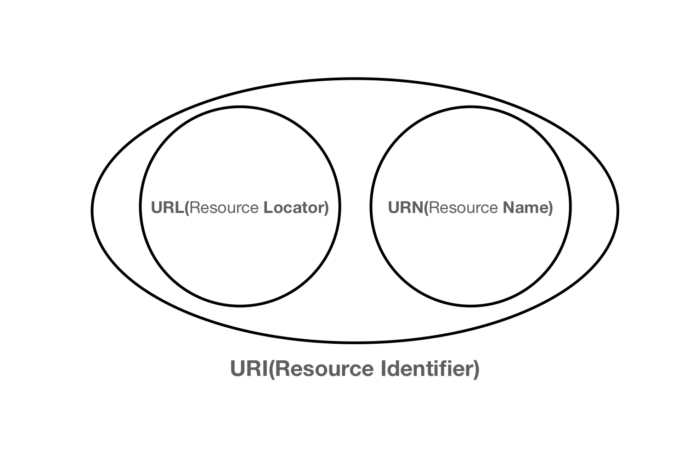
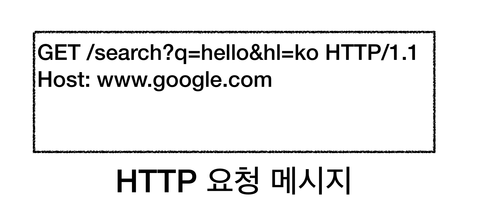

### URI(Uniform Resource Identifier)
URI는 Locator, Name 또는 둘 다 추가로 분류될 수 있다.

- Unifirom
  - 리소스를 식별하는 통일된 방식
- Resource
  - 자원
  - URI로 식별할 수 있는 모든 것(제한 없음)
- Identifier
  - 다른 항목과 구분되는데 필요한 정보

>#### URL
>리소스가 있는 위치를 지정한다.

>#### URN
>리소스에 이름을 부여한다.

자원의 위치는 변할 수 있지만, 이름은 변하지 않는다. URN 이름만으로 실제 리소스를 찾을 수 있는 방법이 보편화 되어 있지 않다.
앞으로 URI를 URL과 같은 의미로 이야기한다.

### URL
#### 전체 문법
`scheme://[userinfo@]host[:port][/path][?query][#fragment]`
`https://www.google.com:443/search?q=hello&hl=ko`

- 프로토콜 (`https`)
- 호스트명 (`www.google.com`)
- 포트 (`443`)
- 패스 (`/search`)
- 쿼리 파라미터(`q=hello&hl=ko`)

#### scheme
- 주로 <u>프로토콜</u>을 사용한다.
>**프로토콜**
> 어떤 방식으로 자원에 접근할 것인지 클라이언트와 서버간의 약속
> 예) http, https, ftp ...

#### userinfo
- URL에 사용자 정보를 포함해서 인증한다.
- 거의 사용하지 않는다.

#### host
- 도메인명 또는 IP 주소를 직접 사용할 수 있다.

#### port
- 접속 포트를 의미한다.
  http는 80포트, https는 443포트를 주로 사용하며, 포트는 생략 가능하다.

#### path
- 리소스의 경로를 나타내며, 계층적 구조를 띄고 있다.
- 예)
  - `/home/file1.jpg`
  - `/members`
  - `/members/100`
  - `/items/iphone12`

#### query
- key=value의 형태를 가진다.
- `?`로 시작하고, `&`로 추가 가능하다.
  - ?keyA=valueA&keyB=valueB`
- query parameter, query string 등으로 불린다.
  - 웹 서버에 전달하는 파라미터
  - 문자열로 전달

#### fragment
- html 내부 북마크 등에 사용한다.
- 서버에 전송하는 정보가 아니다.

### 웹 브라우저 요청 흐름
1. `https://www.google.com:443/search?q=hello&hl=ko`
2. DNS 조회
3. HTTP 요청 메시지 생성

