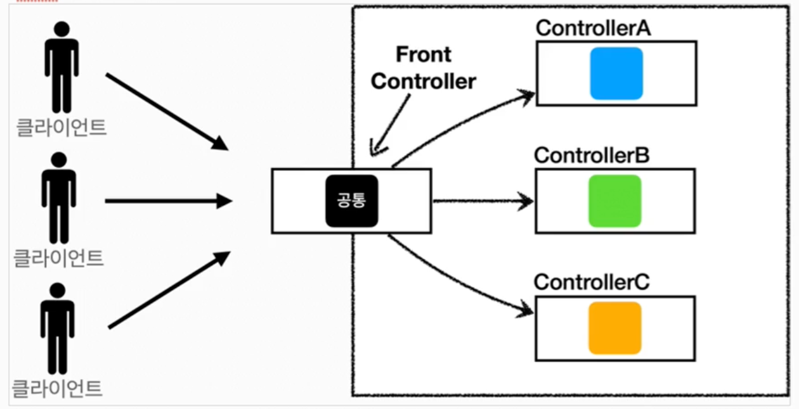

## 프론트 컨트롤러 패턴

프론트 컨트롤러 패턴을 도입하기 전에 공통 로직은 각각의 컨트롤러에 만들어서 사용했다. 프론트 컨트롤러 패턴은 서블릿 하나에 공통 로직을 둬서 컨트롤러가 로직 처리를 하기 전에 공통 로직은 프론트 컨트롤러에서 가져다 사용하는 것이다.
- 특징
    - 프론트 컨트롤러 서블릿 하나로 클라이언트의 요청을 받음
    - 프론트 컨트롤러가 요청에 맞는 컨트롤러를 찾아서 호출
    - 공통 처리 가능
    - 프론트 컨트롤러를 제외한 나머지 컨트롤러는 서블릿을 사용하지 않아도 됨

- 스프링 웹 MVC와 프론트 컨트롤러
    - 스프링 웹 MVCㅇ의 핵심도 프론트 컨트롤러
    - 스프링 웹 MVC의 'DispatcherServlet' 이 프론터 컨트롤러 패턴으로 구현되어 있음

### 프론트 컨트롤러 반영
```java
@WebServlet(name = "frontControllerServletV1", urlPatterns = "/front-controller/v1/*")
```
- urlPattern 의 * 은 이 경로 하위의 모든 요청은 이 서블릿에서 받는다는 의미이다.
- 실제로 개발할 때는 대부분 절대경로를 사용하고, 사용하는 게 낫다.

### View 분리
아직도 컨트롤러에는 공통되는 부분이 남아있다. 바로 뷰로 이동하는 부분이다. 이 부분을 따로 처리하는 View 객체를 만들어서 처리한다.
- 공통 부분
    ```java
    String viewPath = "/WEB-INF/views/save-result.jsp";
    RequestDispatcher dispatcher = request.getRequestDispatcher(viewPath);
    dispatcher.forward(request, response);
    ```
- 뷰
    ```java
    public void render(HttpServletRequest request, HttpServletResponse response) throws ServletException, IOException {
        RequestDispatcher dispatcher = request.getRequestDispatcher(viewPath);
        dispatcher.forward(request, response);
    }
    ```
    - 뷰 객체 안에 호출하는 메소드를 만들었다.
- 각 컨트롤러에서 뷰 호출
    ```java
    return new MyView("/WEB-INF/views/save-result.jsp");
    ```

### Model 추가
컨트롤러에서 파라미터로 HttpServletRequest, HttpServletResponse를 받고 있다. 하지만 이건 사용하지 않는 경우도 많고, 꼭 필요하지 않다. 요청 파라미터 정보만  필요하기 때문에 이것을 자바의 Map으로 넘기면 컨트롤러가 서블릿 기술을 알 필요 없다.<br>
또 컨트롤러에서 뷰를 반환할 때 `/WEB-INF/views/` 가 중복되고 있다. Model을 도입해서 이 부분을 수정해본다. <br>
서블릿 종속성을 제거하기 위해 Model을 만들고 View로 이름을 전달하는 객체 ModelView 객체를 만들어 사용한다.
- 서블릿 종속성 제거
    ```java
    public ModelView process(Map<String, String> paramMap) {

        List<Member> members = memberRepository.findAll();
        ModelView mv = new ModelView("members");
        mv.getModel().put("members", members);

        return mv;
    }
    ```
    - 컨트롤러에서 HttpServletRequest, HttpServletResponse 인자 대신 Map 객체를 사용해 정보를 넘겨준다.
- 뷰 이름 중복 제거
    - 위에서 ModelViewd에 `"members"` 만 세팅한다. 
    - ModelView 객체를 반환받은 프론트 컨트롤러에서 `viewResolver` 메소드로 처리해준다.
    - 뷰 리졸버
        ```java
        private static MyView viewResolver(String viewName) {
        return new MyView("/WEB-INF/views/" + viewName + ".jsp");
        }
        ```
        - `MyView view = viewResolver(viewName)` 컨트롤러가 반환한 논리 뷰 이름을 실제 물리 뷰 경로로 변경한다. 
        - 논리 뷰 : `members`
        - 물리 뷰 : `/WEB-INF/views/members.jsp`
        - 물리 경로가 바뀐 경우 `viewResolver` 안에 경로만 수정하면 된다.

### 단순하고 실용적인 컨트롤러
좋은 프레임워크는 아키텍처 뿐만 아니라 실제 개발하는 개발자가 단순하고 편리하게 사용할 수 있어야 함 <br>
ModelView 객체를 생성하고 반환하는 부분은 개발자에게는 번거로운 부분이다. 컨트롤러에서 ModelView 객체를 반환하는 것이 아닌 주소 String만 반환한다.
```java
public class MemberFormControllerV4 implements ControllerV4 {

    @Override
    public String process(Map<String, String> paramMap, Map<String, Object> model) {
        return "new-form";
    }
}
```

### 유연한 컨트롤러
한 가지 방식의 컨트롤러 인터페이스만 사용하는 것이 아니라 다양한 인터페이스를 사용하는 것을 `어댑터 패턴`이라고 한다. 
- 핸들러 어댑터 : 중간에 어댑터 역할을 하는 어댑터. 다양한 종류의 컨트롤러 호출 가능
- 핸들러 : 컨트롤러를 보다 더 넓은 범위인 핸들러로 명칭을 변경했다. 어댑터가 있기 때문에 컨트롤러의 개념 뿐만 아니라 어떠한 것이든 해당하는 종류의 어댑터만 있으면 다 처리할 수 있기 때문

각 컨트롤러를 처리할 수 있는 어댑터를 만들어서 어떤 컨트롤러를 사용할지 판단하고, 반환형식이 다르더라도 어댑터 형식에 맞춰 변환하여 반환한다.