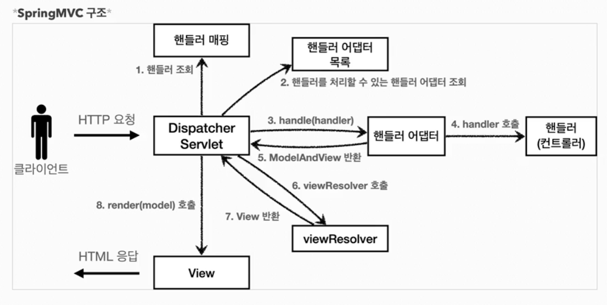

## 스프링 MVC 전체 구조


#### DispatcherServlet
- 프론트 컨트롤러 역할
- HttpServlet 상속
- 스프링부트는 DispatcherServlet을 서블릿으로 자동으로 등록하면서 모든 경로`(urlPatterns="/")`에 대해서 매핑 

#### 동작순서
1. 핸들러 조회 : 핸들러 매핑을 통해 요청 URL에 매핑된 핸들러를 조회
2. 핸들러 어댑터 조회 : 핸들러를 실행할 수 있는 핸들러 어댑터 조회
3. 핸들러 어댑터 실행 
4. 핸들러 실행 : 핸들러 어댑터가 실제 핸들러를 실행
5. ModelAndView 반환 : 핸들러 어댑터는 핸들러가 반환하는 정보를 ModelAndView로 변환해서 반환
6. viewResolver 호출 
7. View 반환 : 뷰 리졸버는 뷰의 논리 이름을 물리 이름으로 바꾸고, 렌더링 역할을 하는 뷰 객체를 반환
8. 뷰 렌더링 : 뷰를 통해서 뷰를 렌더링

## 핸들러 매핑과 핸들러 어댑터
핸들러 매핑에서 사용할 컨트롤러를 찾는다. 핸들러 어댑터는 핸들러 매핑을 통해서 찾은 컨트롤러(핸들러)를 실행할 수 있다. 
개발자가 직접 핸들러 매핑과 핸들러 어댑터를 만드는 일은 거의 없다.

#### HandlerMapping 우선 순위
- 0 = RequestMappingHandlerMapping : 애노테이션 기반의 컨트롤러인 @RequestMapping에서 사용
- 1= BeanNameUrlHandlerMapping : 스프링 빈의 이름으로 핸들러를 찾는다.

#### HandlerAdapter 우선 순위
- 0 = RequestMappingHandlerAdapter : 애노테이션 기반의 컨트롤러인 @RequestMapping에서 사용
- 1 = HttpRequestHandlerAdapter : HttpRequestHandler 처리
- 2 = SimpleControllerHandlerAdapter : Controller 인터페이스(애노테이션X, 과거에 사용) 처리


## 뷰 리졸버
`application.properties`에 `spring.mvc.view.prefix`, `spring.mvc.view.suffix` 설정 정보를 스프링부트가 자동 등록한 뷰 리졸버 `InternalResourceViewResolver`가 자동으로 등록한다.
#### 뷰 리졸버 우선 순위
- 1 = BeanNameViewResolver : 빈 이름으로 뷰를 찾아서 반환한다. (예: 엑셀 파일 생성 기능에 사용)
- 2 = InternalResourceViewResolver : JSP를 처리할 수 있는 뷰를 반환한다.


## 스프링 MVC
#### @Controller
- 내부에 @Component 어노테이션이 있어서 스프링이 자동으로 스프링 빈으로 등록한다. 
- 스프링 MVC에서 어노테이션 기반 컨트롤러로 인식한다.

#### @RequestMapping
- @RequestMapping 어노테이션을 사용하는 컨트롤러는 유연하고, 실용적이다. 
- @RequestMapping 어노테이션을 사용하면 가장 우선순위가 높은 RequestMappingHandlerMapping, RequestMappingHandlerAdapter가 자동으로 사용된다.
- 요청 정보를 매핑해서 해당 URL이 호출되면 이 메서드가 호출
- RequestMappingHandlerMapping은 스프링 빈 중에서 @RequestMapping 또는 @Controller가 클래스 레벨에 붙어 있는 경우 매핑 정보로 인식한다.

#### 컨트롤러 통합
@RequestMapping은 클래스 단위가 아닌 메서드 단위에서도 동작을 한다. 따라서 컨트롤러 클래스를 하나로 만들 수 있다.
```java
@Controller
@RequestMapping("/springmvc/v3/members")
public class SpringMemberControllerV3 {

    private MemberRepository memberRepository = MemberRepository.getInstance();

    @GetMapping("/new-form")
    public String newForm() {
        return "new-form";
    }

    @PostMapping("/save")
    public String save(
            @RequestParam("username") String username,
            @RequestParam("age") int age,
            Model model) {

        Member member = new Member(username, age);
        memberRepository.save(member);

        model.addAttribute("member", member);

        return "save-result";
    }

    @GetMapping
    public String members(Model model) {

        List<Member> members = memberRepository.findAll();

        model.addAttribute("members", members);

        return "members";
    }
}
```
- 메서드 별로 @RequestMapping() 내부에 중복 부분은 클래스 레벨에 @RequestMapping()을 둬서 처리할 수 있다.
- Http 요청 파라미터를 @RequestParam으로 받을 수 있다.
- @RequestMapping을 @GetMapping, @PostMapping으로 변환해서 Http Method도 구분할 수 있다.