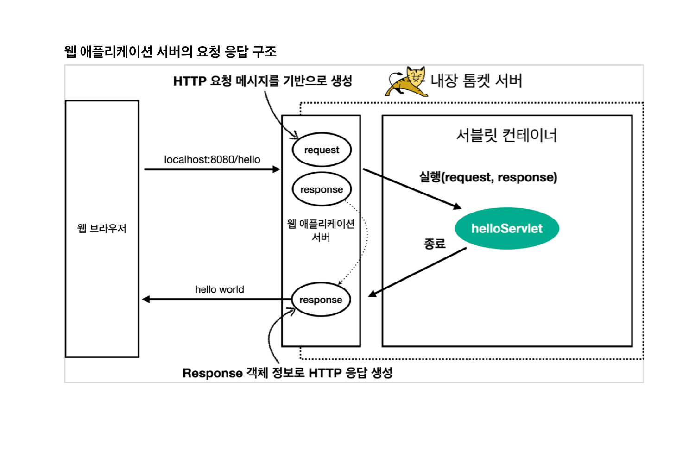

# 서블릿

### 스프링 부트 서블릿 환경 구성

- 스프링부트는 서블릿을 직접 등록해서 사용할 수 있도록 `@ServletComponentScan`을 지원한다.
- `@WebServlet`에 name, urlPatterns를 입력한다. name은 서블릿의 이름을 적용하고, urlPatterns는 URL을 매핑시킨다. 둘은 모두 유니크해야
  한다.

## 서블릿 컨테이너



## HttpServletRequest

### 역할

- HTTP 요청 메시지를 개발자가 직접 파싱하는 것은 매우 불편한다.
- 서블릿은 HTTP 요청 메시지를 편리하게 사용할 수 있도록 HTTP 요청 메시지를 개발자 대신 파싱한다.
- 그 결과를 `HttpServletRequest` 객체에 담아서 제공한다.

### HTTP 요청 메시지

```
POST /save HTTP/1.1
Host: localhost:8080
Content-Type: application/x-www-form-urlencoded

username=kim&age=20
```

- Start Line
    - HTTP Method
    - URL
    - 쿼리 스트링
    - 스키마,프로토콜
- Hedaer
    - Header 조회
- Body
    - form 파라미타 형식 조회
    - message body 데이터 조회

### 임시 저장소

- `HttpServeltRequest`는 임시 저장소 기능도 제공한다.
- 해당 HTTP 요청의 시작부터 끝까지 유지되는 임시 저장소 기능을 제공한다.
    - 저장: `request.setAttribute(name, value)`
    - 조회: `request.getAttribute(name)`

### 세션 관리 기능

- `HttpServeltRequest`는 세션 관리 기능도 제공한다.
    - `request.getSession(create: true)`

### 기본 사용법

#### start line 정보

```
request.getMethod(); // HTTP Method
request.getProtocol; // 예) HTTP/1.1
request.getScheme(); // 예) http
request.getRequestURL();
request.getRequestURI();
request.getQueryString();
request..isSecure; // https 사용 유무
```

#### 헤더 정보

```
request.getHeaderNames().asIterator().forEachRenaming(headerName -> System.out.println(headerName + ": " + request.getHeader(headerName);
```

#### 헤더 편리한 조회

```
// host
request..getServerName(); // 예) localhost 
request.getServerPort(); // 예) 8080


// Accept-Language
request.getLocales().asIterator().forEachRenaming(locale -> System.out.println(locale));
request..getLocale();

// cookie
if (request.getCookies != null){
  for (Cookie cooke : request.getCookies()) {
      System.out.println(cooke.getName() + " : " + cookie.getValue());
     }
  }
  
// content
request.getContentType();
request.getContentLength();
request.getCharacterEncoding();

```

#### 기타 정보

```
// Remote - 요청에 대한 정보
request.getRemoteHost();
request.getRemoteAddr();
request.getRemotePort();

// Local - 나의 서버에 대한 정보
request.getLocalName();
request.getLocalAddr();
request.getLocalPort();
```

## HTTP 요청 데이터

### HTTP 요청 메시지를 통해 클라이언트에서 서버로 데이터를 전달하는 방법

- GET - 쿼리 파라미터
    - `/url?username=hello&age=20`
    - 메시지 바디 없이, URL의 쿼리 파라미터에 데이터를 포함해서 전달
    - 예) 검색, 필터, 페이징
- POST - HTML Form
    - `contenttype: application/x-www-form-urlencoded`
    - 메시지 바디에 쿼리 파라미터 형식으로 전달
        - `username=hello&age=20`
    - 회원가입, 상품 주문, HTML Form 사용
- HTTP message body에 데이터를 직접 담암서 요청
    - HTTP API 에서 주로 사용
        - JSON, XML, TEXT
    - 데이터 형식은 주로 JSON 사용
        - POST, PUT, PATCh

### GET 쿼리 파라미터

- 메시지 바디 없이, URL의 쿼리 파라미터를 사용해서 데이터 전달
- URL에 `?`를 시작으로 보냄
- 추가 파라미터는 `&`으로 구분
- `http://localhost:8080/request-param?username=hello&age=20`

### 복수 파라미터에서 단일 파라미터 조회

- `request.getParameter()`는 하나의 파라미터 이름에 대해서 단 하나의 값만 있을 떄 사용
  -`username=hello&username=kim`과 같이 파라미터 이름은 하나인데, 갑이 중복인 경우에는?
- `request.getParameter()`를 사용하면 `request.getParameterValues()의 첫번째 값 반환

### POST HTML Form

- `content-type: application/x-www-form-urlencoded`
- 메시지 바디에 쿼리 파라미터 형식으로 데이터 전달
- 따라서 쿼리 파라미터 조회 메서드 그대로 사용
- 클라이언트 입장에서는 두 방식에 차이가 있으나, 서버 입장에서는 둘의 형식이 동일

### API 메시지 바디 - 단순 텍스트

- HTTP message body에 데이터를 직접 담아서 요청
- HTTP 메시지 바디의 데이터를 InputStream을 사용해서 읽을 수 있음

### API 메시지 바디 - JSON

- POST http://localhost:8080/request-body-json
- content-type: application/json
- message body: {"username": "hello", "age": 20}
- JSON 결과를 파싱해서 사용할 수 있는 자바 객체로 변환하려면 `Jackson`, `Gson` 같은 JSON 변환 라이브러리 사용

## HTTPServletResponse

### 역할

- HTTP 응답 메시지 생성
    - HTTP 응답 코드 지정
    - 헤더 생성
    - 바디 생성
- 편의 기능 제공
    - Content-Type
    - 쿠키
    - Redirect

### 기본 사용법

```java
// content 편의 메소드
private void content(HttpServletResponse response){
        response.setContentType("text/plain");
        response.setCharacterEncoding("utf-8");
        }

// cookie 편의 메소드
private void cookie(HttpServlet response){
        Cookie cookie new Cookie("myCookie","good");
        cookie.setMaxAge(600);
        response.addCookie(cookie);
        }

// redirect 편의 메소드
private void redirect(HttpServlet response){
        response.setRedirect("/basic/hello-form.html");
        }
```

## HTTP 응답 데이터

### HTML 응답

- HTML 응답으로 HTML을 반환할 때는 `content-type`을 `text/html`로 지정

### API JSON
- HTTP 응답으로 JSON을 반환할 때는 `content-type`을 `application/json`으로 지정
- `Jackson` 라이브러리가 제공하는 `objectMapper.writeValueAsString()`을 사용하면 객체를 JSON문자로 변경 가능