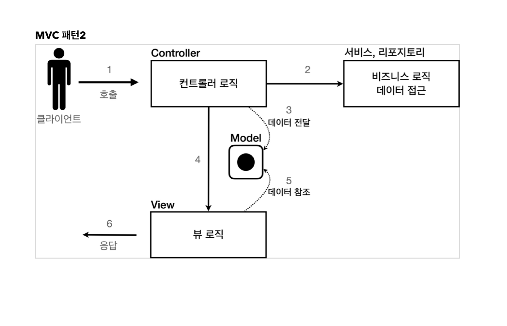

# JSP로 회원 관리 웹 애플리케이션 만들기

## 요구사항

### 회원정보

- 이름: username
- 나이: age

### 기능 요구사항

- 회원 저장
- 회원 목록 조회

### 회원 도메인 모델

```java

@Getter
@Setter
public class Member {

    private Long id;
    private String username;
    private int age;

    public Member() {

    }

    public Member(Sring username, int age) {
        this.username = username;
        this.age = age;
    }
}
```

### 회원 저장소

```java
public class MemberRepository {

    private static Map<Long, Member> store = new HashMap<>();
    private static long sequence = 0L;

    private static final MemberRepository instance = new MemberRepository();

    public static MemberRepository getInstance() {
        return instance;
    }

    private MemberRepository() {

    }

    public Member save(Member member) {
        member.setId(++sequence);
        store.put(member.getId(), member);
        return member;
    }
    
    ...
}
```

## 서블릿으로 회원 관리 웹 애플리케이션 만들기

### `MemberSaveServlet` 동작 순서

1. 파라미터 조회 후 `Member` 객체 생성
2. `Member`객체를 `MemberRepository`를 통해서 저장
3. `Member`객체를 사용해서 결과 화면용 HTML을 동적으로 만들어서 응답

### 템플릿 엔진의 필요성

- 서블릿 덕분에 원하는 HTML을 만들 수 있다.
- 하지만 매우 복잡하고, 비효율적이다.
- 자바코드로 HTML을 만드는 것 보다, HTML 문서에 동적으로 변경해야 하는 부분만 자바코드를 넣는 것이 더 편리할 것이다.
- 이는 템플릿 엔진의 등장 이유이다.

## JSP로 회언 관리 웹 애플리케이션 만들기

- JSP 파일은 `<@ page contentType="text/html;charset=UTF-8" language="java" %>` 로 시작
    - JSP 문서라는 뜻
- JSP는 자바 코드를 그대로 사용할 수 있다.
- `<% ~~~~ %>`
    - 자바 코드 입력
- `<%= ~~~~~~%>`
    - 자바 코드 출력

### JSP과 서블릿과 다른점

- JSP는 HTML을 중심으로 하고, 자바 코드를 추가로 입력한다.
- JSP `<%= ~~~~ %>`를 사용해서 HTML 중간에 자바 코드를 출력한다.
-
    - 서블릿으로 개발할 때는 View를 위한 HTML을 만드는 작업이 자바 코드에 섞여 지저분하고 복잡했다.
- JSP를 사용하면 View를 생성하는 HTML 작업을 깔끔하게 할 수 있고, 중간에 동적으로 변경이 필요한 부분에만 자바 코드를 적용했다.

### 서블릿과 JSP의 한계

- 자바 코드, 데이터를 조회하는 레포지토리 등 다양한 코드가 모두 JSP에 노출된다.
- 하나의 서블릿이나 JSP만으로 비즈니스 로직과 뷰 렌더링까지 모두 처리하게 된다.
- 너무 많은 역할을 하여 유지보수가 어려워진다.
- 이를 해결하기 위해 MVC 패턴이 등장한다.

## MVC 패턴

### 등장 배경

- 하나의 서블릿과 JSP에서 너무 많은 역할을 한다.
- 비즈니스 로직과 뷰는 변경 라이프 사이클이 다르다.
    - UI를 일부 수정하는 일과 비즈니스 로직을 수정하는 일은 다르게 발생할 가능성이 매우 높음
    - 대부분 서로에게 영향을 주지 않음
- JSP같은 뷰 템플릿은 화면을 렌더링하는데 최적화 되어있다.

### Model View Controller

MVC 패턴은 하나의 서블릿이나 JSP로 처리하던 것을 컨트롤러와 뷰라는 영역으로 서로 역할을 나눈 것을 말한다.

- 컨트롤러
    - HTTP 요청을 받아 파라미터를 검증하고 비즈니스 로직을 실행
    - 뷰에 전달할 결과 데이터를 조회해서 모델에 담음
- 모델
    - 뷰에 출력할 데이터를 담음
- 뷰
    - 모델에 담겨있는 데이터를 사용해 화면을 그리는 일에 집중
    - 필요한 데이터는 모두 모델에 담아서 전달해주기 때문에 뷰는 비즈니스 로직이나 데이터 접근을 몰라도됨
      

### 적용

- 서블릿을 컨트롤러로 사용하고, JSP를 뷰로 사용하여 MVC 패턴을 적용한다.
- Model은 `HttpServletRequest`를 객체를 사용한다.
- `request.SetAttribute()`와 `request.getAttribute()`를 사용하여 데이터를 보관, 조회할 수 있다.

#### 회원 등록 폼 - 컨트롤러

- `dispatcher.forward()`
    - 다른 서블릿이나 JSP로 이동 가능
    - 서버 내부에서 다시 호출이 발생
    - 리다이렉트 X

#### 회원 저장 - 뷰
- `<%= request.getAttribute("member")%>` 로 모델에 저장한 `member`를 꺼낼 수 있지만, 너무 복잡해진다.
- JSP는 `${}`문법을 제공한다.
  - request의 attribute에 담긴 데이터를 편하게 조회 가능

### MVC 패턴 한계
- MVC 패턴을 적용하여 컨트롤러의 역할과 뷰 렌더링 역할을 명확하게 구분할 수 있다.
- 뷰는 화면을 그리는 역할에만 충실하여 코드가 깔끔하고 직관적이다. 
  - 모델에서 필요한 데이터를 꺼내고 화면을 만들기만 하면 됨
- 컨터롤러는 중복이 많고, 필요하지 않은 코드가 많다.

#### MVC 컨트롤러의 단점
- 포워드 중복
  - View로 이동하는 코드가 항상 중복 호출됨
  - 메서드로 공통화 하는경우, 헤당 메서드도 반복적으로 호출해야 함
- ViewPath에 중복
  - prefix: `/WEB-INF/views/`
  - suffix: `.jsp`
- 사용하지 않는 코드
  - `HttpServletRequest request, HttpServletResponse response`
- 공통 처리 어려움
  - 기능이 복잡해질 수록 컨트롤러에서 공통으로 처리해야 하는 부분이 더 증가할 것
  - 공통 기능을 메서드로 뽑는 경우, 해당 메서드를 항상 출해야 하고, 호출하는 것 또한 중복
- 프론트 컨트롤러 패턴 도입
  - 수문장 역할을 하는 기능이 필요