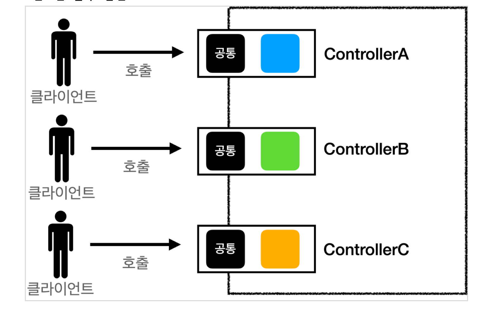
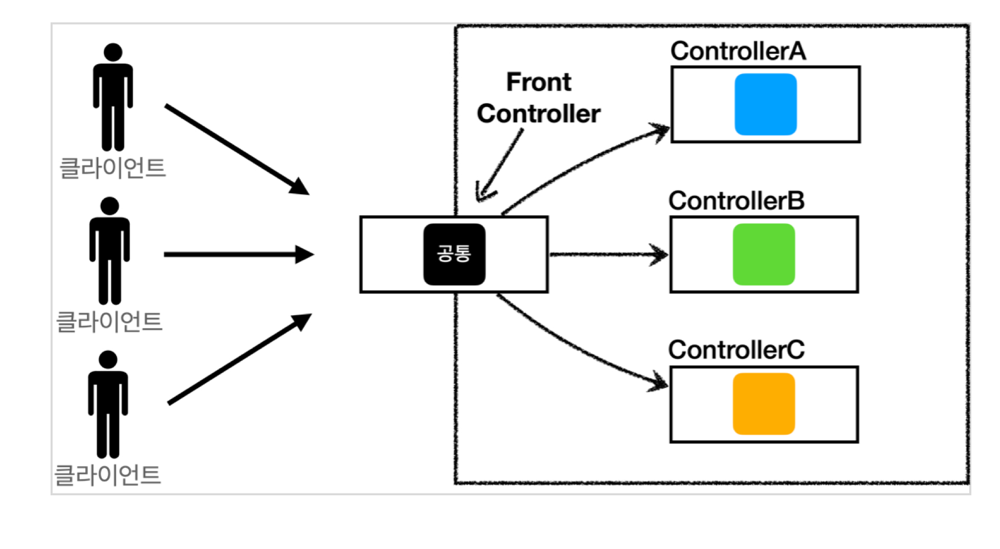
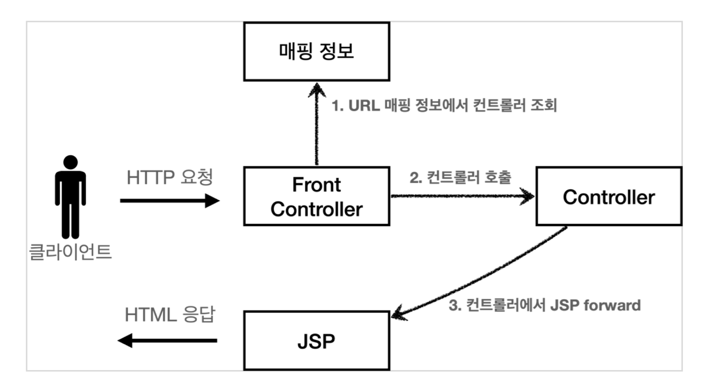
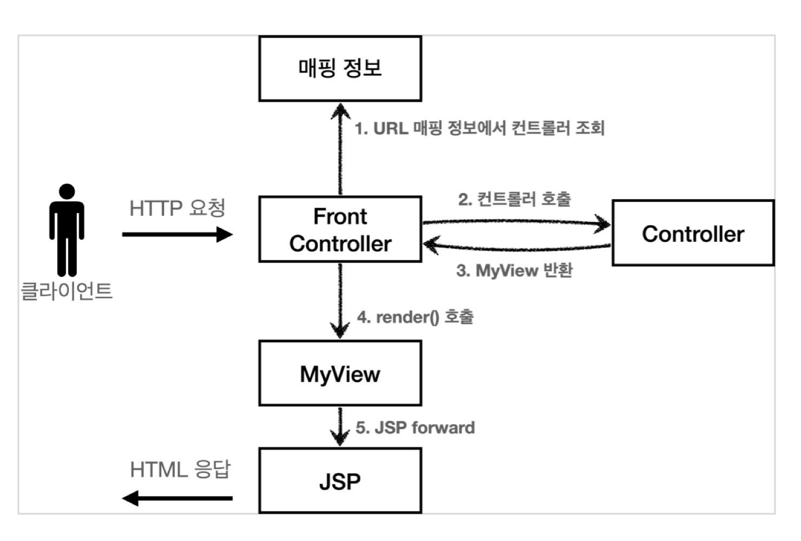
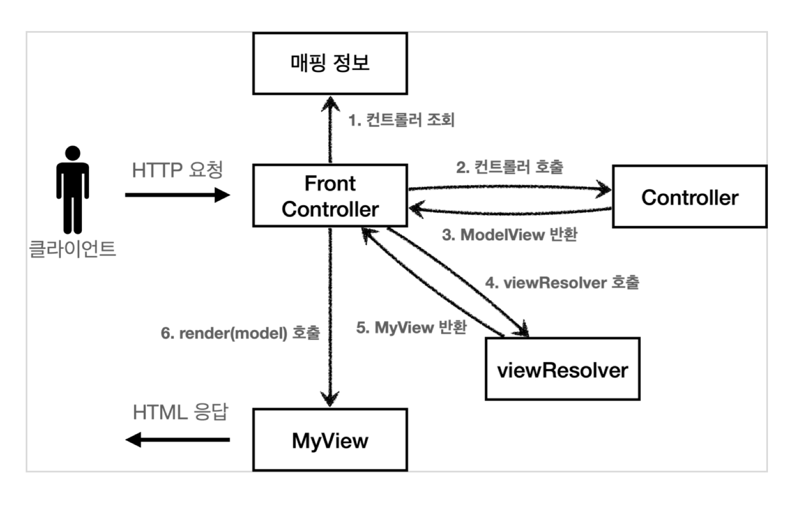
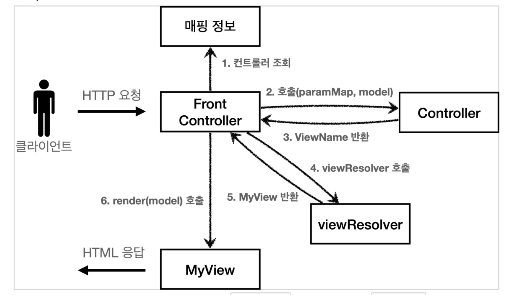
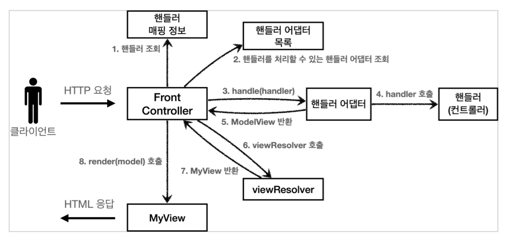

### Front Controller 도입 전



### Front Controller 도입 후


어떤 Controller든지 Front Controller를 통해서 호출된다.

### Front Controller 패턴 특징

- Front Controller Servlet 하나로 클라이언트의 요청을 전부 다 받는다.
- Front Controller가 요청에 맞는 Controller를 찾아서 호출한다.
    - 이전: 고객의 요청이 오면 servlet mapping으로 직접 호출
- 공통 처리가 가능하기 때문에 Front Controller를 제외한 나머지 Controller는 Servlet을 사용하지 않아도 된다.
    - WAS에서 처음 요청이 들어오는 곳이 Servlet

## Front Controller 도입 - v1



- Servlet과 비슷한 모양의 Controller Interface를 도입한다.
    - 각 Controller는 Interface를 구현
- Front Controller는 Interface를 호출하기 때문에 로직의 일관성을 가질 수 있다.

## View 분리 - v2

모든 Controller에서 View로 이동하는 부분에 중복이 있어 깔끔하지 않다.

```java
String viewPath="/WEB-INF/views/new-form.jsp";
        RequestDispatcher requestDispatcher=request.getRequestDispatcher(viewPath);
        requestDispatcher.forward(request,response);
```



- View를 반환할 MyView를 추가한다.
- Controlle는 `dispatcher.forward()`를 직접 생성해서 호출하지 않아도 된다.
- `MyView`객체를 생성하고 뷰 이름만 넣어서 반환하면 된다.

## Model 추가 - v3

### Servlet 종속성 제거

- Controller입장에서 `HttpServletRequest`, `HttpServletResponse`는 필요하지 않다.
- 요청 파라미터 정보를 자바의 Map으로 대신 넘긴다면 Controller는 Servlet기술을 몰라도 된다.

### View 이름 중복 제거

- Controller에서 지정하는 View 이름에 중복이 있다.
    - `/WEB-INF/views`
    - `.jsp`
- Controller는 View의 논리 이름을 반환하고, 실제 물리 위치 이름은 Front Controller에서 처리하도록 단순화할 수 있다.
    - 향후 View의 위치가 변경되는 경우 Front Controller만 수



### Model View

- 지금까지 Controller에서 `HttpServletRequest`를 사용하여 Servlet에 종속적이었다.
- Model은 `request.setAttribute()`를 통해 데이터를 저장하고 뷰에 전달했다.
- Servlet의 종속성을 제거하기 위해 Model을 직접 만들고, View 이름을 전달하는 객체를 만든다.
- Model View는 View의 이름과 View를 렌더링할 때 필요한 model 객체를 갖는다.

### View Resolver

- Controller가 반환한 논리 뷰 이름을 실제 물리 뷰 경로로 변경한다.
- View 객체를 통해 HTML 화면을 렌더링한다.
    - `view.render(mv.getModel(), request, response)`
- JSP는 `request.getAttribute()`로 데이터를 조회하기 떄문에, 모델의 데이터를 꺼내서 `request.setAttribute()`로 담아둔다.
- JSP로 포워드해서 JSP를 렌더링한다.

## 단순하고 실용적인 컨트롤러 - v4



- Controller가 ModelView가 아닌 ViewName을 반환한다.
- 기본 구조는 V3와 같다.

```java
public interface ControllerV4 {

    String process(Map<String, String> paramMap, Map<String, Object> model);

}
```

- model 객체를 파라미터로 전달한다.
- view의 이름을 반환한다.

### model 객체 전달

- model 객체를 Front Controller에서 생성해서 넘겨준다.
    - Controller에서 model 객체에 값을 담으면 Front Controller에서 생성한 model에 값이 담김

### View의 논리 이름 반환

- Controller가 직접 View의 논리 이름을 반환한다.
- ViewResolver를 통해 실제 물리 View 경로를 찾을 수 있다.

## 유연한 컨트롤러 - v5



### 어댑터 패턴

- 지금까지 개발한 Front Controller는 한 가지 방식의 Controller Interface만 사용할 수 있다.
- 어댑터 패턴은 Front Controller가 다양한 방식의 Controller를 처리할 수 있도록 한다.

### 핸들러 어댑터

- 중간에서 어댑터 역할을 한다.
- 어댑터를 통해서 다양한 Controller를 호출할 수 있다.

### 핸들러

- Controller의 이름을 더 넓은 범위인 핸들러로 변경한다.
    - Controller뿐 만 아니라 어떠한 것이든 해당하는 종류의 어댑터만 있으면 처리 가능

### MyHandlerAdapter

```java
public interface MyHandlerAdapter {

    boolean supports(Object handler);

    ModelView handle(HttpServletRequest request, HttpServletResponse response, Object handler)
            throws ServletException, IOException;
}
```

#### boolean supports(Object handler);

- handler는 Controller를 말한다.
- 어댑터가 해당 Controller를 처리할 수 있는지 판단한다.

#### ModelView handle(HttpServletRequest request, HttpServletResponse response, Object handler)
throws ServletException, IOException;
- 어댑터는 실제 Controller를 호출하고, 그 결과 ModelView를 반환한다.

### Controller -> handler
- 이전에는 Controller를 직접 매핑해서 사용했다.
- 이제는 어댑터를 이용하여 어떤 것이라도 URL에 매핑해서 사용할 수 있다.
