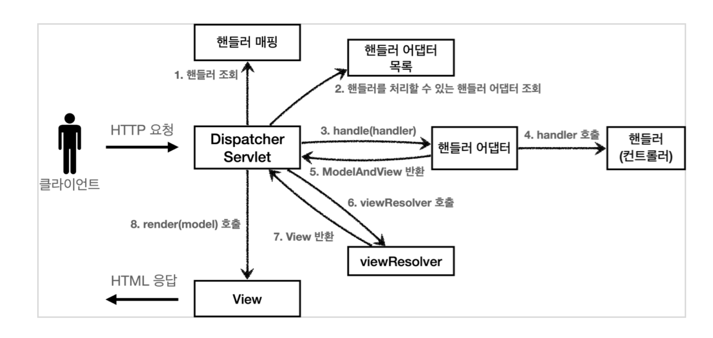

## 스프링 MVC 전체 구조



1. 핸들러 조회
    - 핸들러 매핑을 통해 요청 URL에 매핑된 핸들러(컨트롤러)를 조회
2. 핸들러 어댑터 조회
    - 핸들러를 실행할 수 있는 핸들러 어댑터 조회
3. 핸들러 어댑터 실행
4. 핸들러 실행
    - 핸들러 어댑터가 실제 핸들러 실행
5. ModelAndView 반환
    - 핸들러 어댑터는 핸들러가 반환하는 정보를 ModelAndView로 변환해서 반환
6. viewResolver 호출
    - JSP: `InternalResourceViewResolver`가 자동 등록되고 사용됨
7. view 반환
    - JSP: `InternalResourceView(JstlView)`를 반환, 내부에 `forward()`로직이 있음
8. view 렌더링

## 핸들러 매핑과 핸들러 어댑터

### 핸들러 매핑

- 핸들러 매핑에서 컨트롤러를 찾는다.
    - 예) 스프링 빈의 이름으로 핸들러를 찾을 수 있는 핸들러 매핑이 필요

### 스프링 부트가 자동 등록하는 핸들러 매핑

순서대로 찾고, 없으면 다음 순서로 넘어간다.

0. RequestMappingHandlerAdapter

    - 애노테이션 기반 컨트롤러인 `@RequestMapping`에서 사용

1. BeanNameUrlHandlerMapping
    - 스프링 빈의 이름으로 핸들러를 찾음

### 핸들러 어댑터

- 핸들러 매핑을 통해서 찾은 핸들러를 실행할 수 있는 핸들러 어댑터를 찾는다.
    - 예) `Controller` 인터페이스를 실행할 수 있는 핸들러 어댑터를 찾아서 실행

### 스프링 부트가 자동 등록하는 핸들러 어댑터

순서대로 찾고, 없으면 다음 순서로 넘어간다.

0. RequestMappingHandlerAdapter
    - 애노테이션 기반 컨트롤러인 `@RequestMapping`에서 사용
1. HttpRequestHandlerAdapter
    - HttpRequestHandler 처리
2. SimpleControllerHandlerAdapter
    - Controller 인터페이스 처리(애노테이션 X, 과거에 사용)

## 뷰 리졸버

### 스프링 부트가 자동 등록하는 뷰 리졸버(일부 생략)

1. BeanNameViewResolver
    - 빈 이름으로 뷰를 찾아서 반환
2. InternalResourceViewResolver
    - JSP를 처리할 수 있는 뷰 반환

> 다른 뷰는 실제 뷰를 렌더링하지만, JSP의 경우 `forward()`를 통해서 해당 JSP로 이동해야 렌더링이 된다. JSP를 제외한 나머지 뷰 템플릿은 `forward()`
> 과정없이 바로 렌더링 된다.

## v1 - Spring MVC 시작하기

- RequestMappingHandlerMapping은 `@RequestMapping` 또는 `@Controller`가 클래스 레벨에 붙어있는 경우에 매핑 정보로 인식한다.

### @Controller

- 스프링이 자동으로 빈으로 등록한다.
    - 내부에 `@Componenr` 애노테이션이 있어서 컴포넌트 스캔 대상이 됨
    - Spring MVC에서 애노테이션 기반 컨트롤러로 인식

### @RequestMapping

- RequestMappingHandlerMapping
- RequestMappingHandlerAdapter
- 우선순위가 가장 높은 핸들러 매핑과 핸들러 어댑터
- 실무에서는 99.9% 이 방식의 컨트롤러 사용
- 요청 정보를 매핑한다.

> 스프링 3.0이상에서는 클래스 레벨에 `@Controller`가 있어야 스프링 컨트롤러로 인식한다. `@RequestMapping`은 인식하지 않는다.
> `@RestController`는 해당 애노테이션 내부에 `@Controller`를 포함하고 있으므로 인식된다.

## v2 - 컨트롤러 통합 
- v1에서는 `@RequestMapping`가 클래스 단위가 아니라 메서드 단위에 적용되었다.
- 컨트롤러 클래스로 유연하게 하나로 통합할 수 있다.
- 클래스 레벨과 메서드 레벨의 조합도 가능하다.
```java
@Controller
@RequestMapping("/springmvc/v2/members")
public class SpringMemberControllerV2 {
    
}
```
- 클래스 레벨 `@RequestMapping("/springmvc/v2/members")`
  - 메서드 레벨 `ReqeustMapping("/new-form")` -> /springmvc/v2/members/new-form

## v3 - 실용적인 방식
- MVC 프레임워크 만들기에서 v3은 ModelView를 개발자가 직접 생성해서 반환했다. -> 불편함
- Model을 도입한다.
- VeiwName을 직접 반환한다.
- `@RequestParam`을 사용한다.
- `@RequestMapping`을 `@GetMapping`, `@PostMapping`으로 변환한다.
```java
@Controller
@RequestMapping("/springmvc/v3/members")
public class SpringMemberControllerV3 {
    @PostMapping("/save")
    public String save(
            @RequestParam("username") String username,
            @RequestParam("age") int age,
            Model mode) {
        Member member = new Member(username, age);
        memberRepository.save(member);

        model.addAttribute("member", member);
        return "save-result";
    }
}
```

### @RequestParam
- `@RequestParam("username")`은  `request.getParameter("username")`와 거의 비슷하다.
- GET 쿼리 파라미터, POST Form 방식을 모두 지원한다.

### @RequestMapping -> @GetMapping, @PostMapping
- `@RequestMapping`은 URL만 매칭하는 것이 아니라, HTTP Method도 구분할 수 있다.
- `@RequestMapping(value="/new-form", method=RequestMethod.GET)`
- `@GetMapping("/new-form")`

 