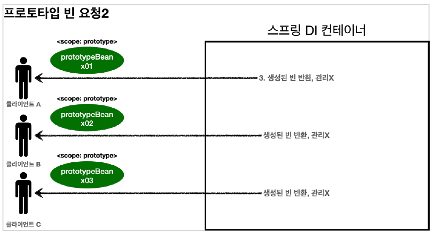

# 싱글톤 스코프(=빈 스코프)

스프링 빈은 기본적으로 싱글톤 스코프로 생성된다. 스코프는 **빈이 존재할 수 있는 범위**를 뜻한다.

- **싱글톤**: 기본 스코프, 스프링 컨테이너의 시작과 종료까지 유지되는 가장 넓은 스코프
- **프로토타입**: 스프링 컨테이너는 프로토타입 빈의 생성과 의존관계 주입까지만 관여하고 더는 관리하지 않는 매우 짧은 범위의 스코프이다.
- **웹 관련 스코프**
    - request: 웹 요청이 들어오고 나갈 때까지 유지되는 스코프
    - session: 웹 세션이 생성되고 종료될 때까지 유지되는 스코프
    - application: 웹의 서블릿 컨텍스트와 같은 범위로 유지되는 스코프

&nbsp;

# 프로토타입 스코프

프로토타입 빈은 보통 아래의 경우에 사용한다.

- 여러 인스턴스를 검색해야 하는 경우
- 인스턴스를 지연 혹은 선택적으로 찾아야 하는 경우
- 순환 종속성을 깨기 위해서
- 스코프에 포함된 인스턴스로부터 더 작은 범위의 인스턴스를 찾아 추상화 하기 위해서 사용한다.

<div align="center">
    
</div>

&nbsp;

- 싱글톤 빈 → **컨테이너 생성 시점**에서 같이 생성되고 초기화, **항상 같은 인스턴스 반환**
- 프로토타입 빈 → **컨테이너에서 빈을 조회할 때** 생성되고 초기화, **항상 새로운 인스턴스 반환**

&nbsp;

```java
@Scope("prototype")
@Bean
PrototypeBean HelloBean() {
	return new HelloBean();
}
```

스프링 컨테이너는 **프로토타입 빈을 생성하고, 의존관계 주입, 초기화까지만 처리한다.**

클라이언트에 빈을 반환하고, 이후 스프링 컨테이너는 생성된 **프로토타입 빈을 관리하지 않는다.**

프로토타입 빈을 관리할 책임은 프로토타입 빈을 받은 클라이언트에 있다. 그래서 @PreDestroy 같은 **종료 메서드가 호출되지 않는다.**

&nbsp;

### 싱글톤  빈과 프로토타입 빈을 함께 사용할 때,

프로토타입 빈으로 항상 새로운 인스턴스를 생성하고자 할 때,

여기서 주의할 점은 스프링은 일반적으로 싱글톤 빈을 사용하기 때문에 프로토타입 빈을 무작정 요청하기만 해서는 원하는 결과를 얻을 수 없다는 것이다.

싱글톤 빈의 스코프는 스프링 컨테이너와 같은데, 프로토타입 스코프의 스프링 빈이 새로 생성되기는 했지만 싱글톤 빈과 함께 사용되기 때문에 계속 유지한다. 그래서 빈을 여러번 요청해도 동일한 프로토타입 빈을 사용하게 되어 원하는 결과를 얻을 수 없게 된다.

&nbsp;

**클라이언트가 프로토타입 빈만 직접 사용하면 몰라도 싱글톤 빈과 함께 사용해야 하는 경우에는 어떻게 하면 좋을까?**

→ 싱글톤 빈에서 프로토타입 빈을 매번 새로 호출하면 되지 않을까?

```java
static class ClientBean{
		@Autowired
    private ApplicationContext ac;

    public int logic() {
				PrototypeBean prototypeBean = ac.getBean(PrototypeBean.class);
        prototypeBean.addCount();
        int count = prototypeBean.getCount();
        return count;
    }
}
```

위와 같은 동작은 의존관계를 외부에서 주입하는 것이 아닌 **직접 필요한 의존관계를 찾는 것**을 의미한다고 해서 **Dependency Lookup(DL)**이라고 부른다.

하지만 매번 이런식으로 스프링 애플리케이션 컨텍스트 전체를 주입받게 되면 스프링 컨테이너와 종속성이 생기고 테스트도 어려워진다.

&nbsp;

### ObjectFactory, ObjectProvider, ****JSR-330 Provider****

- ObjectFactory: 지정한 빈을 컨테이너에서 대신 찾아주는 DL 서비스를 제공해준다. 그리고 **스프링에 의존**한다.
- ObjectProvider: ObjectFactory에 편의기능들을 추가한 객체이다. 그리고 **스프링에 의존**한다.

```java
static class ClientBean{
    @Autowired
    private ObjectProvider<PrototypeBean> prototypeBeanProvider;

    public int logic() {
        PrototypeBean prototypeBean = prototypeBeanProvider.getObject();
        prototypeBean.addCount();
        int count = prototypeBean.getCount();
        return count;
    }
}
```

&nbsp;

ObjectProvider를 사용하면 내부에서 스프링 컨테이너를 통해 해당 빈을 찾아서 반환한다. **(DL)**

스프링에 종속적인 것은 동일하지만, 기능이 단순해서 단위테스트 및 Mock을 이용한 테스트 더블을 준비하기 쉽다.

&nbsp;

ObjectProvider는 기본적으로 스프링에 의존하는데, 그걸 원치 않는다면 `javax.inject.Provider` 패키지의 **JSR-330 자바 표준**을 사용하는 방법도 있다.

→ 자바 표준을 사용할 일은 드물지만, 구현하고자 하는 기능이 다른 컨테이너에서도 모두 호환되어야 한다면 자바 표준을 사용하면 된다.

```groovy
dependencies {
  implementation 'org.springframework.boot:spring-boot-starter'
  implementation 'javax.inject:javax.inject:1'
	...
}
```

```java
import javax.inject.Provider;

...
static class ClientBean{
    @Autowired
    private Provider<PrototypeBean> prototypeBeanProvider;

    public int logic() {
        PrototypeBean prototypeBean = prototypeBeanProvider.get();
        prototypeBean.addCount();
        int count = prototypeBean.getCount();
        return count;
    }
}
```

&nbsp;

# 웹 스코프

웹 소코프는 웹 환경에서 동작하며, 프로토타입과 다르게 스프링이 해당 스코프의 종료시점까지 관리한다.

웹 스코프는 해당 URL를 통한 클라이언트 요청이 ‘총 몇 번이 이루어졌고, 각 요청 당 몇 초가 걸렸는지, 실행 메서드가 몇 초 걸렸는지’와 같은 상황에서 사용하면 유용하다.

&nbsp;

- request
    - HTTP 요청 하나가 들어오고 나갈 때 까지 유지되는 스코프.
    - 각각의 HTTP 요청마다 별도의 빈 인스턴스가 생성되고, 관리된다.
    - HTTP 요청이 처리되면 종료 메서드가 호출된다. (프로토타입 스코프와 다른 점)
- session
    - HTTP Session과 동일한 생명주기를 가진다.
- application
    - 서블릿 컨텍스트(ServletContext)와 동일한 생명주기를 가진다.
- websocket
    - 웹 소켓과 동일한 생명주기를 가진다.

&nbsp;

### 스프링 웹 라이브러리

```groovy
implementation 'org.springframework.boot:spring-boot-starter-web'
```

스프링 부트는 웹 라이브러리가 없으면 `AnnotationConfigApplicationContext`를 기반으로 애플리케이션을 구동한다.

만약, 웹 라이브러리가 추가되면 웹 관련된 추가 설정과 환경들이 필요하기 때문에 `AnnotationConfigServletWebServerApplicationContext`를 기반으로 애플리케이션을 구동한다.

&nbsp;

### request 스코프

request 스코프는 동시에 여러 HTTP 요청이 들어오는 상황에서 로그를 쉽게 구분할 수 있다.

`@Scope(value = “request”)`를 사용해서 스코프를 지정하면, 해당 빈은 HTTP 요청 당 하나씩 생성되고, HTTP 요청이 끝나는 시점에 소멸된다.

다수 클라이언트들로부터의 HTTP 요청에 따른 request 스코프는 각각 구분되기 때문에 값이 섞일 걱정은 하지 않아도 된다.

```java
@Component
@Scope(value = "request")
public class MyLogger { }
```

&nbsp;

### 스코프와 Provider

하지만 스프링 애플리케이션이 처음 시작할 시점에는 request 스코프 빈은 아직 존재하지 않는 상태이기 때문에 오류가 발생한다.

request 스코프 빈은 실제로 고객의 요청이 올 때에만 생성할 수 있는데, 이 문제를 해결하기 위해 Provider를 사용할 수 있다.

```java
@Service
@RequiredArgsConstructor
public class LogDemoService {
	private final ObjectProvider<MyLogger> myLoggerProvider;
	public void logic(String id) {
		MyLogger myLogger = myLoggerProvider.getObject();
		myLogger.log("service id = " + id);
	}
}
```

&nbsp;

### 스코프와 프록시

하지만 Provider 보다 더 편한 방법이 존재한다. (웹 스코프가 아니어도 사용할 수 있는 기능임.)

&nbsp;

`@Scope`에 아래와 같은 속성을 추가해주면 된다.

```java
@Component
@Scope(value = "request", proxyMode = ScopedProxyMode.TARGET_CLASS)
public class MyLogger { }
```

이렇게 하면 해당 클래스를 가짜 프록시 클래스로 만들어주기 때문에 HTTP request와 관계 없이 다른 빈에 미리 주입해 둘 수 있다.

Provider를 사용하든 프록시를 사용하든 둘 다 가짜 클래스를 사용한다. 이것은 진짜 HTTP 요청이 올 때 그제서야 진짜 클래스를 찾아 매핑한다.