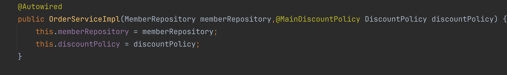

# 다양한 의존 관계 주입 방법

## 생성자 주입

- 생성자 호출 시점에 딱 1번만 호출된다.
- 빈 등록과 의존 관계 주입이 같이 일어난다.
- 불변 의존 관계에 사용된다.
    - 생성자는 한 번만 호출되기 때문에, 생성 이후 수정이 불가
- 필수 의존 관계에 사용
    - `final`을 사용하기 때문에 반드시 값 필요

```java

@Component
public class OrderServiceImpl implements OrderService {

    private final MemberRepository memberRepository;
    private final DiscountPolicy discountPolicy;

    @Autowired
    public OrderServiceImpl(MemberRepository memberRepository, DiscountPolicy discountPolicy) {
        this.memberRepository = memberRepository;
        this.discountPolicy = discountPolicy;
    }
}

```

> 생성자가 1개만 있다면 `@Autowired`는 생략 가능하다.

## 수정자 주입 (setter 주입)

- `setter`라고 불리는 필드의 값을 변경하는 수정자 메서드를 통해서 의존 관계를 주입한다.
- 선택, 변경 가능성이 있는 의존 관계에 사용한다.
- 자바빈 프로퍼티 규약의 수정자 메서드 방식을 사용하는 방법이다.

```java

@Component
public class OrderServiceImpl implements OrderService {

    private MemberRepository memberRepository;
    private DiscountPolicy discountPolicy;

    @Autowired
    public void setMemberRepository(MemberRepository memberRepository) {
        this.memberRepository = memberRepository;
    }

    @Autowired
    public void setDiscountPolicy(DiscountPolicy discountPolicy) {
        this.discountPolicy = discountPolicy;
    }
}
```

> `@Autowired`는 주입할 대상이 없으면 오류가 발생한다. 주입할 대상이 없어도 오류가 발생하지 않으려면 `@Autowired(required = false)`로
> 지정한다.

> **자바빈 프로퍼티 규약**
>
> 자바는 필드의 값을 직접 변경하지 않고, `getter`와 `setter` 메서드를 이용해 값을 읽거나, 값을 수정하는 규칙을 만들었다. 이를 자바빈 프로퍼티 규약이라고 한다.

## 필드 주입

- 필드에 의존 관계를 직접 주입한다.
- 외부에서 변경이 불가능하여 테스트가 힘들다.

## 일반 메서드 주입

- 한 번에 여러 필드를 주입받을 수 있다.
- 일반적으로 잘 사용하지 않는다.

> 의존 관계 주입은 스프링 컨테이너가 관리하는 스프링 빈이어야 동작한다. 스프링 빈이 아닌 `Member` 같은 클래스에서 `@Autowired` 코드를 적용하면 아무 기능도
> 작동하지 않는다.

## 옵션 처리

주입할 스프링 빈이 없어도 동작해야 할 때가 있다. `@Autowired`만 사용하면 `requried` 옵션의 기본값이 `true`로 되어 있기 때문에 자동 주입 대상이 없으면
오류가 발생한다.

자동 주입 대상을 옵션으로 처리하는 방법은 다음과 같다.

- `@Autowired(required = false)`
    - 자동 주입할 대상이 없으면 수정자 메서드 자체가 호출되지 않음
- `org.springframeword.lang.@Nullable`
    - 자동 주입할 대상이 없으면 `null`이 입력됨
- `Optional<>`
    - 자동 주입할 대상이 없으면 `Optional.empty`가 입력됨

```java
@Autowired(required = false)
public void setNobBean1(Member member){
        System.out.println("setNoBean1 = "+member); // 호출 안됨
        }

@Autowired
public void setNoBean2(@Nullable Member member){
        System.out.println("setNoBean2 = "+member); // null
        }

@Autowired
public void setNoBean3(Optional<Member> member){
        System.out.println("setNoBean3 = "+member); // Optional.empty
        }
```

## 생성자 주입 선택

- 대부분의 의존 관계 주입은 한 번 일어나면 애플리케이션 종료 시점까지 의존 관계를 변경할 일이 없다. 대부분의 의존 관계는 애플리케이션 종료 까지 변해선 안된다.
- 수정자 주입을 사용하면, `setter`메서드를 `public`으로 열어두야 한다.
- 누군가 실수로 변경할 수도 있기 때문에 변경하면 안되는 메서드를 열어두는 것은 좋은 설계 방법이 아니다.
- 생성자 주입은 불변하게 설계 가능하다.

```java
public class OrderServiceImpl implements OrderService {

    private final MemberRepository memberRepository;
    private final DiscountPolicy discountPolicy;

    @Autowired
    public OrderServiceImpl(MemberRepository memberRepository, DiscountPolicy discountPolicy) {
        this.memberRepository = memberRepository;
        this.discountPolicy = discountPolicy;
    }

}
```

> 생성자 주입을 사용하면 필드에 `final` 키워드를 사용할 수 있다. 생성자에 혹시라도 값이 설정되지 않는 오류를 컴파일 시점에 막을 수 있다. 생성자 주입을 제외한 다른
> 주입
> 방식은 모두 생성자 이후에 호출되므로, 필드에 `final` 키워드를 사용할 수 없다.

### 생성자 주입 방식 선택 이유

- 프레임워크에 의존하지 않고 순수한 자바 언어 특징을 잘 살리는 방법이다.
- 기본으로 생성자 주입을 사용하고, 필수 값이 아닌 경우에는 수정자 주입 방식을 옵션으로 부여한다.
    - 생성자 주입과 수정자 주입을 동시에 사용

## 롬복과 최신 트랜드

```java

@Component
@RequiredArgsConstructor
public class OrderServiceImpl implements OrderService {

    private final MemberRepository memberRepository;
    private final DiscountPolicy discountPolicy;

}
```

- `@RequiredArgsConstructor` 를 사용하면 `final`이 붙은 필드를 파라미터로 받는 생성자를 자동으로 만든다.

## 조회되는 빈이 2개 이상인 경우

`@Autowired`는 타입으로 조회한다.

```java

@Component
public class FixDiscountPolicy implements DiscountPolicy {

}
```

```java

@Component
public class rateDiscountPolicy implements DiscountPolicy {

}
```

`FixDiscountPolicy`와 `RateDiscountPolicy` 둘 다 스프링 빈으로 선언했다.

```java
@Autowired
private DiscountPolicy discountPolicy;
```

의존관계 자동 주입을 실행하는 경우 `NoUniqueBeanDefinitionException`이 발생한다. 하나의 빈을
기대했지만, `fixDiscountPolicy`, `rateDiscountPolicy` 2개의 빈이 발견됐기 때문이다.

해결 방법으로는 3가지 방법이 있다.

- `@Autowired` 필드명 매칭
- `@Qualifier`
- `@Primary`

### @Autowired 필드명 매칭

`@Autowired`는 타입 매칭을 시도할 때, 여러 빈이 있으면 필드 이름, 파라미터 이름으로 빈 이름을 추가 매칭한다.

```java
@Autowired
private DiscountPolicy rateDiscountPolicy;
```

필드명이 `rateDiscountPolicy`로 주입된다.

> 필드명 매칭은 먼저 타입 매칭을 시도하고, 그 결과에 여러 빈이 있을 때 추가로 동작하는 기능이다.

### @Qualifier

`@Qualifier`는 추가 구분자를 붙여주는 방법이다.빈 이름을 변경하는 것이 아니라, 주입 시 추가적인 방법을 제공하는 것이다.

```java

@Component
@Qualifier("mainDiscountPolicy")
public class RateDiscountPolicy implements DiscountPolicy {

}
```

```java

@Component
@Qualifier("fixDiscountPolicy")
public class fixDiscountPolicy implements DiscountPolicy {

}
```

빈 등록시 `@Qualifier` 를 붙여준다.

```java
@Autowired
public OrderServiceImpl(MemberRepository memberRepository,@Qualifier("mainDiscountPolicy") DiscountPolicy disocuntPolicy){
        this.memberRespository=memberRepository;
        this.discountPolicy=discountPolicy;
        }

```

주입 시에 `@Qualifier`를 붙여주고 등록한 이름을 적는다.

> **@Qualifier("mainDiscountPolicy")를 찾지 못하면 어떻게 될까?**
>
>`mainDiscountPolicy`라는 이름의 스프링 빈을 추가로 찾는다. 빈 이름도 없는 경우에는 `NoSuchBeanDefinitionException`이 발생한다.
> 빈 이름을 찾는 기능이 있지만, `@Qualifier`는 `@Qualifier`를 찾는 용도로만 명확하게 사용하는 것이 좋다.

### @Primary

`@Primary`는 우선 순위를 정하는 방법이다. `@Autowired`를 통해 여러 빈이 매칭되면 `@Primary`가 우선권을 갖는다.

```java

@Component
@Primary
public class RateDiscountPolicy implements DiscountPolicy {

}
```

```java

@Component
public class FixDiscountPolicy implements DiscountPolicy {

}
```

```java
@Autowired
public OrderServiceImpl(MemberRepository memberRepository,DisocuntPolicy discountPolicy){
        this.memberRepository=memberRepository;
        this.discountPolicy=discountPolicy;
        }
```


### @Primary와 @Qualifier 활용

두 개의 스프링 빈이 있다.

하나는 코드에서 자주 사용하는 메인 데이터베이스의 커넥션을 획득하는 스프링 빈이다.
다른 하나는 코드에서 특별한 기능으로 가끔 사용하는 서브 데이터베이스의 커넥션을 획득하는 스프링 빈이다.

- 메인 데이터베이스의 커넥션을 획득하는 스프링빈
    - `@Primary`를 적용해서 조회하는 곳에서 조회
- 서브 데이터베이스의 커넥션을 획득하는 스프링빈
    - `@Qualifier`를 지정해서 명시적으로 획득하는 방식으로 조회

> **우선순위**
> `@Primary`는 기본값처럼 동작한다. 반면에 `@Qualifier`는 매우 상세하게 동작한다. 스프링은 자동보다 수동이, 넓은 범위의 선택권 보다는 좁은 범위의 선택권이
> 우선 순위가 높다. 따라서 `@Primary`보다 `@Qualifier`의 우선권이 높다.

## 애노테이션 직접 만들기

`@Qualifier("mainDiscountPolicy)` 처럼 적으면 컴파일 시 타입 체크가 되지 않는다. 이와 같은 문제는 애노테이션을 직접 만들어서 해결할 수 있다.





## 조회한 빈이 모두 필요할 때
의도적으로 특정 타입의 스프링 빈이 모두 다 필요한 경우가 있다. 예를 들어 할인 서비스를 제공하는데, 클라이언트가 할인의 종류(rate, fix)를 선택할 수 있다. 


- `policyMap`의 키에 스프링 빈의 이름을 넣고, 값으로 `DiscountPolicy`타입으로 조회한 모든 스프링 빈을 담는다.
- `policies`에 `DiscountPolicy`타입으로 조회한 모든 스프링 빈을 담는다.
- 만약 해당하는 타입의 스프링 빈이 없다면 빈 컬렉션이나 빈 Map이다.
- `DiscountService`는 `Map`으로 모든 `DiscountPolicy`를 주입받는다.
- `discount` 메서드는 `discountCode`에 해당하는 스프링 빈을 `policyMap`에서 찾아서 실행한다.  


