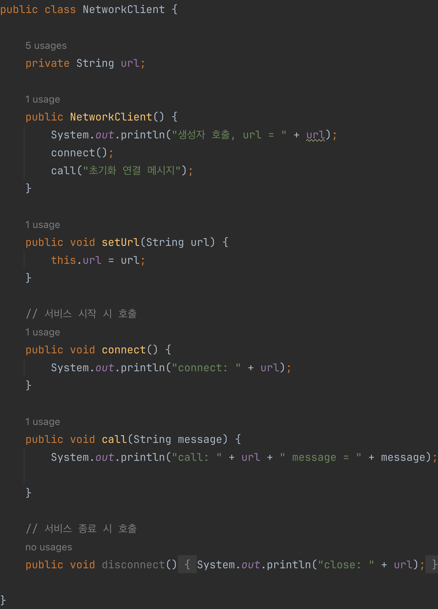
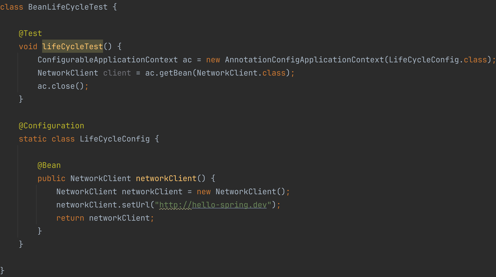
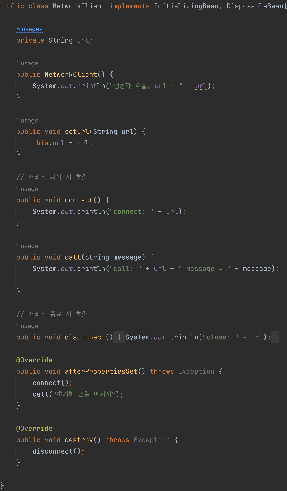
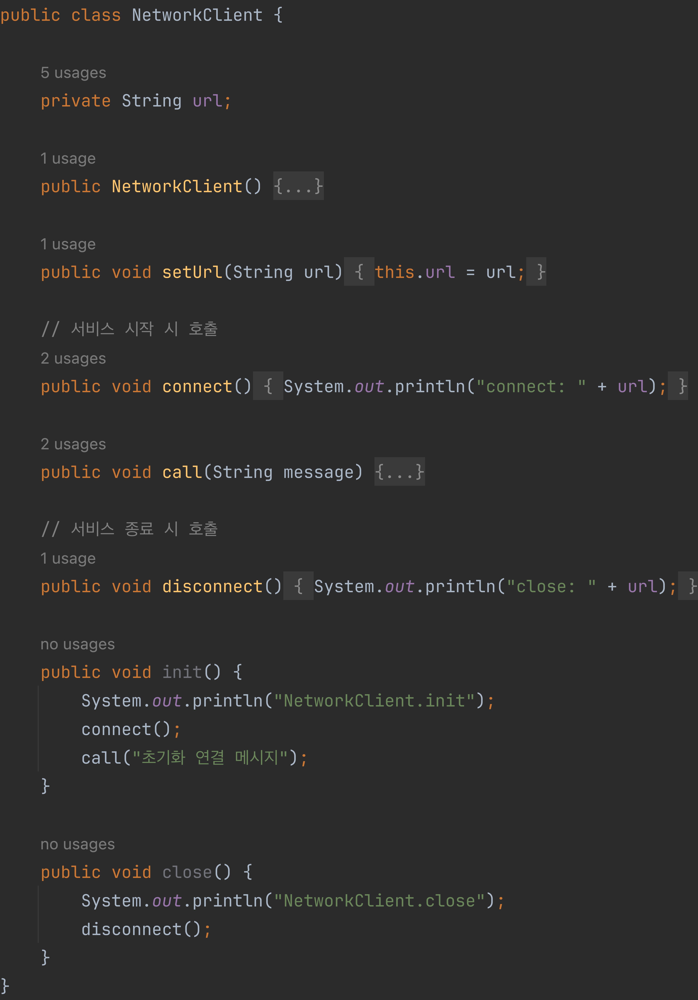
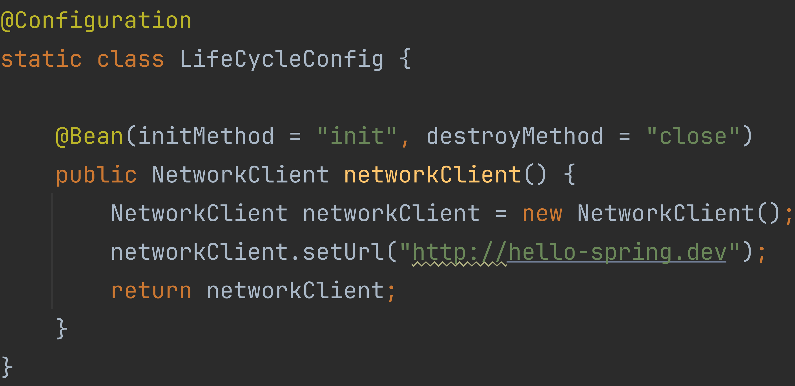
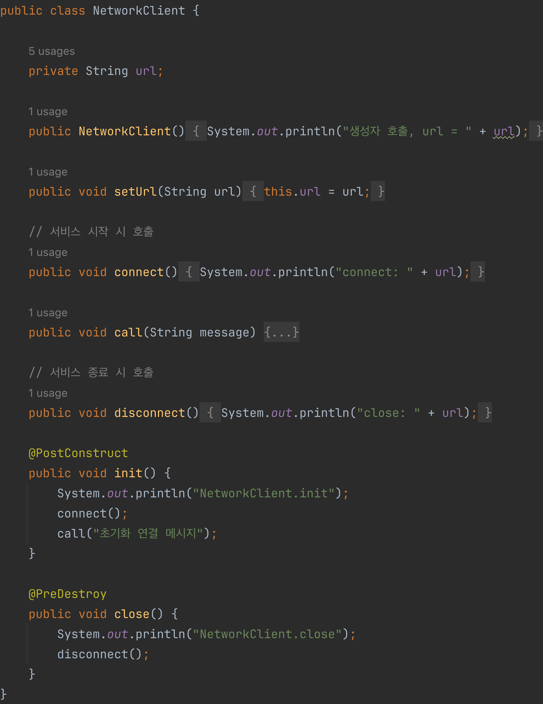

# 빈 생명 주기 콜백

<u>데이터베이스 커넥션 풀</u>이나, <u>네트워크 소켓</u>처럼 애플리케이션에 필요한 연결을 미리 해두고, 애플리케이션 종료 시점에 연결을 모두 종료하는 직업을 진행하려면
객체의 초기화와 종료 작업이 필요하다.

> **데이터베이스 커넥션 풀**
>
> 미리 여러 개의 데이터베이스 커넥션을 설정해 놓고 필요할때마다 꺼내쓰는
> 방법을 데이터베이스 커넥션 풀이라고 한다. 사용자로부터 웹 애플리케이션에 요청이 들어올 때마다 데이터베이스를 연결하고, 해체하는 것은 비효율적이기 때문에 데이터베이스 커넥션
> 풀을 이용한다.


> **네트워크 소켓**
>
> 네트워크 소켓은 네트워크로 연결되어 있는 컴퓨터의 통신 점점에 위치한 통신 객체를 말한다. 네트워크 통신을 위한 프로그램들은 소켓을 생성하고, 이 소켓을 통해서 서로 데이터를
> 교환한다.

## 빈 생명 주기 콜백 시작


간단한 외부 네트워크에 연결하는 객체, `NetworkClient` 를 생성한다. `NetworkClient`는 애플리케이션 시작 시점에 `connect()`를 호출해서 연결을
맺어야하고, 애플리케이션이 종료되면 `disconnect()`를 호출해서 연결을 끊어야 한다.



```java
// 출력
생성자 호출,url=null
        connect:null
        call:null message=초기화 연결 메시지
```

`url`정보 없이 `connect`메소드가 호출되었다. 객체를 생성하는 단계에 `url`이 없고, 객체를 생성한 다음에 수정자 주입을 통해서 `setUrl`메소드가
호출되어야 `url`값을 넣어줄 수 있다.

스프링 빈은 객체를 생성하고, 의존 관계 주입이 끝난 다음에야 필요한 데이터를 사용할 수 있는 준비가 완료된다. 따라서 초기화 작업은 의존 관계 주입이 모두 완료되고 난 다음에
호출해야 한다. 그렇다면 개발자는 의존 관계 주입이 모두 완료된 시점을 어떻게 알수 있을까?

스프링은 의존 관계 주입이 완료되면 스프링 빈에게 콜백 메서드를 통해서 초기화 시점을 알려주는 기능을 제공하며, 스프링 컨테이너가 종료되기 직전에 소멸 콜백을 준다.

> **스프링 빈의 라이프 사이클**
>
> 스프링 컨테이너 생성 -> 스프링 빈 생성 -> 의존 관계 주입 -> 초기화 콜백 -> 스프링 빈 사용 -> 소멸 전 콜백 -> 스프링 종료
>
>`setter`주입이나 필드 주입의 경우 스프링 빈이 생성되고 의존 관계가 주입된다. 그러나 생성자 주입의 경우 스프링 빈 생성과 의존 관계 주입이 같이 일어난다.

### 객체의 생성과 초기화 분리
생성자 안에서 무거운 초기화 작업을 함께 하는 것 보다, 객체를 생성하는 부분과 초기화 하는 부분을 명확하게 나누는 것이 유지보수 관점에서 좋다.

| 분류  |역할|
|-----|--|
| 생성자 |필수 정보를 받고, 메모리를 할당해서 객체를 생성하는 책임을 가짐|
| 초기화 |생성된 값들을 활용해서 외부 커넥션을 하는 등 무거운 동작을 수행|

## 빈 생명 주기 콜백 지원
스프링은 크게 3가지 방법으로 빈 생명 주기 콜백을 지원한다.
- 인터페이스(`InitializingBean`, `DisposableBean`)
- 설정 정보에 초기화 메서드, 종료 메서드 지정
- `@PostConstruct`, `@PreDestroy`

### 인터페이스 `InitializingBean`, `DisposableBean`


- `InitilizingBean`은 `afterPropertiesSet`메서드로 초기화를 지원한다.
- `DisposableBean`은 `destroy`메서드로 소멸을 지원한다.


```java
// `lifeCycleTest` 실행 후 출력 결과
생성자 호출, url = null
connect: http://hello-spring.dev
call: http://hello-spring.dev message = 초기화 연결 메시지
19:09:42.253 [main] DEBUG org.springframework.context.annotation.AnnotationConfigApplicationContext - Closing org.springframework.context.annotation.AnnotationConfigApplicationContext@3967e60c, started on Fri Nov 03 19:09:42 KST 2023
close: http://hello-spring.dev
```
- 초기화 메서드가 의존 관계 주입이 완료된 후에 적절하게 호출된 것을 확인할 수 있다.
- 스프링 컨테이너의 종료가 호출되자 소멸 메서드가 적절하게 호출된 것을 확인할 수 있다.

**인터페이스 `InitializingBean`, `DisposableBean` 단점**
- 두 인터페이스는 스프링 전용 인터페이스이기 때문에, 해당 코드가 스프링 전용 인터페이스에 의존한다.
- 초기화, 소멸 메서드의 이름을 변경할 수 없다.
- 코드를 고칠 수 없는 외부 라이브러리에 적용할 수 없다.

> 인터페이스 `InitializingBean`, `DisposableBean`는 지금은 거의 사용하지 않는 방법이다.
 
### 빈 등록 초기화, 소멸 메서드 지정




```java
// `lifeCycleTest' 실행 후 출력 결과
생성자 호출, url = null
NetworkClient.init
connect: http://hello-spring.dev
call: http://hello-spring.dev message = 초기화 연결 메시지
19:20:01.150 [main] DEBUG org.springframework.context.annotation.AnnotationConfigApplicationContext - Closing org.springframework.context.annotation.AnnotationConfigApplicationContext@48aaecc3, started on Fri Nov 03 19:20:00 KST 2023
NetworkClient.close
close: http://hello-spring.dev
```

**설정 정보(`initMethod`, `destroyMethod`)를 사용 특징**
- 메서드 이름을 자유롭게 지정할 수 있다.
- 스프링 빈이 스프링 코드에 의존하지 않는다.
- 코드를 고칠 수 없는 외부 라이브러리에도 적용 가능하다.

**종료 메서드 추론**
- `@Bean`의 `destroyMethos`는 기본값이 `(inferred)`로 등록되어 있다.
- `(inferred)`는 `close`, `shutdown`이라는 이름의 메서드를 자동으로 호출한다.
  - 스프링 빈으로 등록하면 종료 메서드는 따로 적을 필요 없음
  - 추론 기능이 싫으면 `destroyMethod = ""`라고 입력

### @PostConstruct, @PreDestroy


- 최신 스프링에서 가장 권장하는 방법이다.
- 두 개의 애노테이션만 사용하면 되기 때문에 편리하게 초기화와 종료를 실행할 수 있다.
- 두 애노테이션은 `javax.annotation`패키지에 있다.
  - 스프링에 종속적인 기술이 아니라, 자바 표준이다.
- 외부 라이브러리에는 적용하지 못한다.
  - 외부 라이브러리를 초기화 종료하려면 `@Bean`의 `initMethod`, `destroyMethod` 사용
