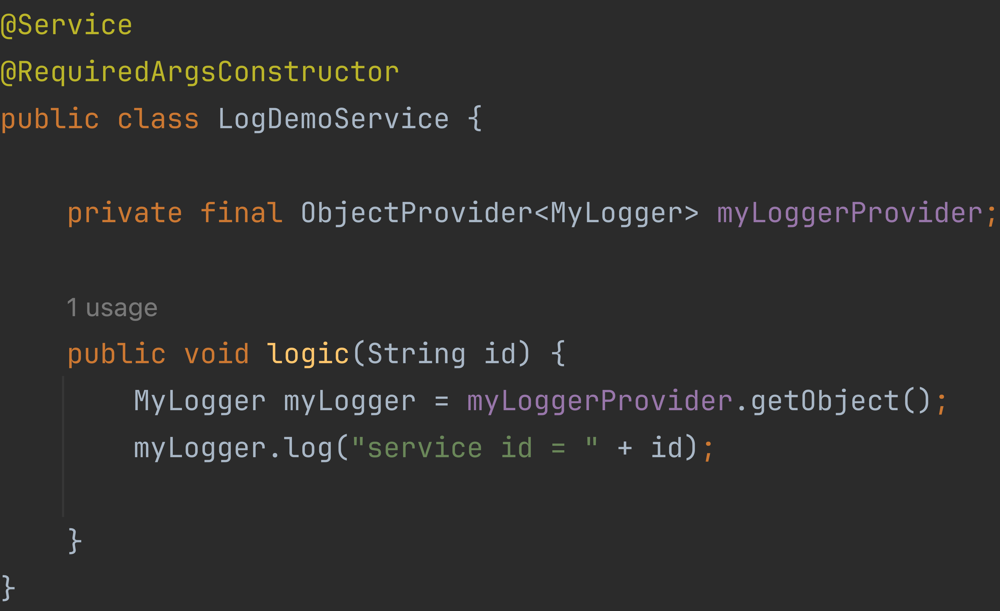

# 빈 스코프란?

빈 스코프는 빈이 존재할 수 있는 범위를 뜻한다.

스프링은 다양한 스코프를 지원한다.

- 싱글톤
    - 기본 스코프
    - 스프링 컨테이너의 시작부터 종료까지 유지되는 가장 넓은 범위의 스코프
- 프로토타입
    - 스프링 컨테이너는 프로토타입의 생성부터 의존 관계 주입까지만 관여
- 웹 관련 스코프
    - request: 웹 요청이 들어올 때부터 나갈 때까지 유지되는 스코프
    - session: 웹 세션이 생성될 때부터 종료될 때까지 유지되는 스코프
    - application: 웹의 서블릿 컨테스트와 같은 범위로 유지되는 스코프

스코프는 다음과 같이 지정할 수 있다.

```java
// 자동 등록
@Scope("prototype")
@Component
public class Bean {

}
```

```java
// 수동 등록
@Scope("prototype")
@Bean
PrototypeBean Bean(){
        return new Bean();
        }
```

## 프로토타입 스코프

| 스코프 종류 | 특징                                     |
|--------|----------------------------------------|
| 싱글톤    | 싱글톤 스코프의 빈을 조회하면 스프링 컨테이너는 항상 같은 빈을 반환 |
| 프로토타입  | 프로토타입의 빈을 조회하면 스프링 컨테이너는 항상 새로운 빈을 반환  |

- 프로토타입 빈은 스프링 컨테이너에 요청할 때마다 새로 생성된다.
- 스프링 컨테이너는 프로토타입 빈을 생성하고, 의존 관계를 주입하고, 초기화 까지만 처리를 한다.
- 빈을 반환한 이후에는 생성된 프로토타입 빈을 관리하지 않는다.
    - `@PreDestroy` 같은 종료 메서드는 호출되지 않음
- 프로토타입 빈은 프로토타입 빈을 조회한 클라이언트가 관리해야 한다.
    - 종료 메서드 호출도 클라이언트가 직접 해야 함
    - `prototypeBean.destroy();`


- 싱글톤 빈은 스프링 컨테이너 생성 시점에 초기화 메서드가 실행된다.
- 스프링 컨테이너가 종료될 때 스프링 빈의 종료 메서드가 실행되었다.


- 프로토타입 빈은 스프링 컨테이너에서 빈을 조회할 때 생성되고 초기화 메서드가 실행된다.
- 포로토타입 빈을 2번 조회했으므로 2개의 스프링 빈이 생성되고, 초기화 되었다.
- 스프링 컨테이너가 프로토타입 빈의 생성과 의존 관계 주입, 초기화까지만 관여하고, 더는 관리하지 않는다.
    - 컨테이너가 종료될 때 `@PreDestroy` 종료 메서드는 실행되지 않음

### 프로토타입 스코프 - 싱글톤 빈 함께 사용 시 문제점

스프링 컨터에니어 프로토타입 스코프의 빈을 요청하면 항상 새로운 인스턴스를 생성해서 반환한다. 하지만 싱글톤 빈과 함께 사용할 때는 의도한 대로 동작하지 않으므로 주의해야 한다.

**프로토타입 빈 직접 요청**


1. 클라이언트1이 스프링 컨테이너에 프로토타입 빈을 요청한다.
2. 스프링 컨테이너는 프로토타입 빈을 새로 생성해서 반환한다.(`prototypeBean1`)
3. 클라이언트는 프로토타입 빈에 `addCount`메소드를 호출하면서 `count`필드를 +1 한다.
4. 결과적으로 프로토타입 빈의 `count`는 1이 된다.
   <br/>
   <br/>
5. 클라이언트2가 스프링 컨테이너에 프로토타입 빈을 요청한다.
6. 스프링 컨테이너는 프로토타입 빈을 새로 생성해서 반환한다.(`prototypeBean2`)
7. 클라이언트2는 프로토타입 빈에 `addCount`메소드를 호출하면서 `count`필드를 +1 한다.
8. 결과적으로 프로토타입 빈의 `count`는 1이 된다.
9.


1. `clientBean1`은 스프링 컨테이너 생성 시점에 생성되고, 의존 관계 주입도 발생한다.
2. 의존 관계 주입 시점에 스프링 컨테이너에 프로토타입 빈을 요청한다.
3. 스프링 컨테이너는 프로토타입 빈을 생성해서 `clientBean1`에 반환한다.
4. `clientBean`은 프로토타입 빈을 내부 필드에 보관한다.
   <br/>
   <br/>
5. `clientBean1`은 `clientBean1.logic()`을 호출한다.
6. `clientBean`은 `prototypeBean`의 `addCount()`를 호출해서 `count`를 +1한다.
   <br/>
   <br/>
7. `clientBean2`는 `clientBean2.logic()`을 호출한다.
8. `clientBean2`은 `prototypeBean`의 `addCount()`를 호출해서 `count`를 +1한다.
9. `count`는 2가 된다.

> `clientBean2`가 내부에 갖고 있는 `prototypeBean`은 과거에 주입이 끝난 빈이다.
> 주입 시점에 스프링 컨테이너에 요청해서 새로운 프로토타입 빈이 생성된 것이지, 사용할 때마다 새로운 빈이 생성되는 것은 아니다.

싱글톤 빈은 생성 시점에만 의존관계 주입을 받는다. 따라서 프로토타입 빈이 처음에는 새로 생성되기는 하지만, 싱글톤 빈과 함께 계속 유지가 된다.

### 싱글톤 빈 - 프로토타입 빈 함께 사용 시 Provider로 문제 해결

싱글톤 빈과 프로토타입 빈을 함께 사용할 때, 사용할 때마다 새로운 프로토타입 빈을 생성하는 가장 간단한 방법은 그 때마다 스프링 컨테이너에 새로 요청하는 것이다.

```java
@Autowired
private ApplicationContext ac;

public int logic(){
        PrototypeBean prototypeBean=ac.getBean(PrototypeBean.class);

        prototypeBean.addCount();
        int count=prototype.getCount();
        return count;
        }

```

- `ac.getBean()`을 통해서 항상 새로운 프로토타입 빈이 생성된다.
- 의존 관계를 외부에서 주입받는게 아니라 직접 필요한 의존 관계를 찾는 것을 Dependency Lookup(DL, 의존 관계 조회)라고 한다.
- 스프링의 애플리케이션 컨텍스트 전체를 주입받으면 스프링 컨테이너에 종속적인 코드가 되고, 단위테스트가 어려워진다.
- 필요한 기능은 지정한 프로토타입 빈을 컨테이너에서 대신 찾아주는 기능(DL) 정도이다.

**ObjectFactory, ObjectProvider**

지정한 빈을 컨테이너에서 찾아주는 DL 기능을 제공하는 것이 `ObjectProvider`이다. `ObjectProvider`는 `ObjectFactory`에 편의 기능이
추가되었다.

```java
@Autowired
private ObjectProvider<PrototyeBean> prototypeBeanProvider;

public int logic(){
        PrototypeBean prototypeBean=prototypeBeanProvider.getObject();

        prototypeBean.addCount();
        int count=prototype.getCount();
        return count;
        }

```

- `prototypeBeanProvider.getObject()`를 통해서 항상 새로운 프토로타입 빈이 생성된다.
- `ObjectProvider`의 `getObject()`를 호출하면 내부에서 스프링 컨테이너를 통해 해당 빈을 찾아서 반환한다. (DL)
- 기능이 단순하여 단위테스트를 만들거나 mock코드를 만들기 쉽다.

> **ObjectFactory**
>
> 기능이 단순하다. 별도의 라이브러리가 필요없고, 스프링에 의존한다.
>

> **ObjectProvider**
>
> ObjectFactory를 상속받는다. 옵션, 스트림 처리 등 편의 기능이 많다. 별도의 라이브러리가 필요 없고, 스프링에 의존한다.

**JSR-330 Provider**
`javax.inject.Provider`는 JSR-330 자바 표준을 사용하는 방법이다.

> 스프링 부트 3.0은 `jakarta.inject.Provider`를 사용한다.

사용을 위해 gradle에 라이브러리를 추가한다.

```
dependencies{
    // 스프링부트 2.0
    implementation 'javax.inject:javax.inject:1'
    
    // 스프링부트 3.0
    implementation 'jakarta.inject-api:2.0.1'
        }


```

```java
@Autowired
private Provider<PrototyeBean> provider;

public int logic(){
        PrototypeBean prototypeBean=provider.get();

        prototypeBean.addCount();
        int count=prototype.getCount();
        return count;
        }

```

- `provider.get()`을 통해서 항상 새로운 프로토타입 빈이 생성된다.
- `Provider`의 `get()`를 호출하면 내부에서 스프링 컨테이너를 통해 해당 빈을 찾아서 반환한다. (DL)
- 기능이 단순하여 단위테스트를 만들거나 mock코드를 만들기가 훨씬 쉽다.
- 자바 표준이므로 스프링이 아닌 다른 컨테이너에서도 사용할 수 있다.
- 별도의 라이브러리가 필요하다.

## 웹 스코프

웹 스코프는 웹 환경에서만 동작하기 때문에 라이브러리 추가가 필요하다. 웹 스코프는 프로토타입과 다르게 스프링이 해당 스코프의 종료 시점까지 관리하다. 따라서 종료 메서드가
호출된다.

```
dependencies {
   implementation 'org.springframework.boot:spring-boot-starter-web' 
        }
```

- `spring-boot-starter-web` 라이브러리를 추가하면 스프링부트는 내장 톰캣 서버를 활용해서 웹 서버와 스프링을 함께 실행시킨다.
- 웹 라이브러리가 추가되면 웹과 관련된 추가 설정과 환경이 필요하므로 `AnnotationConfigServletWebServerApplicationContext`를 기반으로
  애플리케이션을 구동한다.
- 기본 포트 8080을 사용한다.

### 웹 스코프 종류

- request
    - HTTP 요청 하나가 들어오고 나갈 때까지 유지되는 스코프
    - HHTP 요청마다 별도의 빈 인스터스가 생성되고 관리됨
- session
    - HTTP session과 동일한 생명 주기를 지니는 스코프
- application
    - 서블릿 컨텍스트와 동일한 생명 주기를 지니는 스코프
- websocket
    - 웹 소켓과 동일한 생명 주기를 지니는 스코프

### request 스코프

동시에 여러 HTTP 요청이 오면 정확히 어떤 요청이 남긴 로그인지 구분하기 어렵다. 이 때 사용하기 좋은 것이 request 스코프다.

**request 스코프 예제 개발**

- UUID를 사용해서 HTTP 요청을 구분
- requestURL 정보를 추가하여 어떤 URL을 요청해서 남은 로그인지 확인


- 로그를 출력하기 위한 스프링 빈이다.
- `@Scope(value = "request")`를 사용해서 request 스코프로 지정했다.
    - 이 빈은 HTTP 요청 당 하나 씩 생성되고 HTTP 요청이 끝나는 시점에 소멸됨
- 생성되는 시점에 자동으로 `@PostConstruct` 초기화 메서드를 사용해서 uuid를 생성하고 저장한다.
    - uuid로 HTTP 요청들을 구분 가능
- 소멸되는 시점에 `@PreDestroy`를 사용해서 종료 메시지를 남긴다.
- `requestURL`은 빈이 생성되는 시점에는 알 수 없으므로 외부에서 setter로 입력받는다.


- 로거가 잘 작동하는지 확인하는 테스트용 컨트롤러이다.
- HttpServletRequest를 통해서 요청 URL을 받는다.
    - requestURL: http://localhost:8080/log-demo
- `requestURL`을 `myLogger`에 저장한다.
- 컨트롤러에 `controller test`라는 로그를 남긴다.


- 웹과 관련된 부분은 컨트롤러까지만 사용한다.
    - request scope를 사용하지 않고 파라미터로 모든 정보를 서비스 계층에 넘기면 파라미터가 지저분해짐
    - `requestURL` 같은 웹 관련 정보가 웹과 관련없는 서비스 계층까지 넘어가게 됨
    - 서비스 계층은 웹 기술에 종속되지 않고, 순수하게 유지하는 것이 유지보수 관점에서 좋음
- request scope의 `MyLogger` 덕분에 웹과 관련된 정보를 파라미터로 넘기지 않고, `MyLogger`의 멤버변수에 저장해서 코드와 계층을 깔끔하게 유지할 수
  있다.


- 스프링 애플리케이션을 실행하는 시점에, 싱글톤 빈은 생성해서 주입이 가능하지만, request 스코프 빈은 아직 생성되지 않는다. request 스코프 빈은 실제 고객의 요청이
  있어야 생성할 수 있다.


### 스코프와 Provider




- `ObjectProvider` 덕분에 `ObjectProvider.getObject()`를 호출하는 시점까지 request scope 빈의 생성을 지연할 수 있다.
- `ObjectProvider.getObject()`를 호출하는 시점에는 HTTP 요청이 진행중이므로 request scope 빈의 생성이 정상 처리된다.
- `ObjectProvider.getObject()`를 `LogDemoContollrer`, `LogDemoService`에서 한 번씩 따로 호출해도 같은 HTTP 요청이라면 같은 스프링 빈이 반환된다.

### 스코프와 프록시
```java
@Component
@Scope(value = "request", proxyMode = ScopedProxyMode.TARGET_CLASS)
public class MyLogger {
    
}
```
- `proxyMode = ScopedProxyMode.TARGET_CLASS` 추가한다.
  - 적용 대상이 인터페이스가 아니라 클래스라면 `TARGET_CLASS` 선택
  - 적용 대상이 인터페이스라면 `INTERFACES` 선택
- `MyLogger`의 가짜 프록시 클래스를 만들어두고 HTTP request와 상관 없이 가짜 프록시 클래스를 다른 빈에 미리 주입해 둘 수 있다.

**웹 스코프와 프록시 동작 원리**
CGLIB라는 라이브러리로 내 클래스를 상속받은 가짜 프록시 객체를 만들어서 주입한다.
- `@Scope`에 `proxyMode = ScopedProxyMode.TARGET_CLASS` 설정하면 스프링 컨테이너는 CGLIB라는 바이트코드를 조작하는 라이브러리를 사용해서, MyLogger를 상속받은 가짜 프록시 객체를 생성한다.
  - `MyLogger$$EnhancerBySpringCGLIB`라는 클래스로 만들어진 객체가 대신 등록됨
  - 스프링 컨테이너에 `myLogger`라는 이름으로 가짜 프록시 객체 등록
  - `ac.getBean("myLogger", MyLogger.class)` 조회하면 프록시 객체가 조회
  - 의존 관계 주입도 가짜 프록시 객체가 주입됨
- 가짜 프록시 객체는 실제 요청이 오면 그 때  내부에서 진짜 빈을 요청하는 위임 로직이 있다
- 가짜 프록시 객체는 원본 클래스를 상속 받았기 때문에, 클라이언트는 원본인지 아닌지 알지 못하고, 동일하게 상요할 수 있다.

**Provider와 프록시**
- 진짜 객체 조회를 필요한 시점까지 지연처리한다.